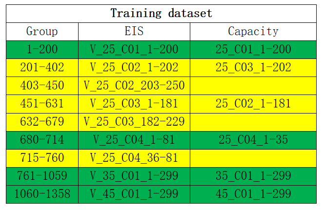

# Identifying degradation patterns of lithium ion batteries from impedance spectroscopy using machine learning 

### 23.5.12

zscore标准化：减去均值，除标准差

### 关于数据 集

 ox/red=1表示完全充电后的容量。ox/red=0表示放电后的容量。 

关于论文` Identifying degradation patterns of lithium ion batteries from impedance spectroscopy using
machine learning `

单温度模型：

`Capacity estimation`

```c
1. train_data: 25C01~25C04;
2. test_data: 25C05~25C08;

    容量针对起始容量进行归一化处理
```

`RUL prediction`

```c

```

多温度模型

`Capacity estimation`

```c
1. train_data : 25C01~25C04,35C01,45C01;->EIS_data
    EIS_data:1358*120 :
		/*[)
			＊ 1~201是25C01
        	＊ 201~381是25C02 
        	
        	* 381~451？
        	
        	＊ 451~652 是25C03 
        	
        	* 652~680？
        	
        	* 680~714 是25C04 
        	
        	* 714~761？
        	
        	* 761~1060  是35C01 
        	* 1060~1358 是45C01 
		*/


```


| 电池  | EIS_data_V循环次数 | Capacity_data循环次数 |       循环次数交集       |
| :---: | :----------------: | :-------------------: | :----------------------: |
| 25C02 |        250         |          180          |           180            |
| 25C01 |        261         |          349          |           261            |
| 25C03 |        229         |          201          |           201            |
| 25C04 |         81         |          34           |            34            |
| 35C01 |        327         |          326          |           326            |
| 45C01 |        299         |          299          |           299            |
|       |        1447        |         1389          | 1301（**EIS_data_new**） |



原始数据 是如何测量的：

**状态V：**充满电后静置15分钟

**电池**：12块45mAh Eunicell LR2032 锂离子纽扣电池，分别25，35，45温度下的气候室中循环，每个周期包括一个1C速率(45mAh)，CC-CV（恒流-恒压）充电到4.2V，一个2C (90mAh) CC（恒流）放电到3V

**EIS和Capacity**： 过在每个偶数次循环（偶数次循环通常是在电池充电或放电 达到稳定状态后进行的）中的充电/放电的九个不同阶段，以0.02 Hz至20 kHz的频率范围进行测量。测试时使用5 mA的激励电流，并在SoC为0%和100%时进行15分钟的开路测试，在每个奇数次循环后，测定容量损失。 

​	**开路测试：**将电池断开连接，观察电池在静止状态下的行为，通过完全放电 和完全充电状态下的开路测试，可	以确定电池的开路电压和内部自放电速率，这些 数据 可以用来评估电池的自放电特性和存储能量的损失情况

​	**关于直流和松弛条件的不同情况：**指在测试过程中采用不同充放电模式和时间，直流条件指恒定电流（5mA）	施加到电池中进行充电或放电，而松弛条件是指施加完电池后，等待一段时间以使电池达到稳定状态。


# Data-driven prediction of battery cycle life before capacity degradation 

## 读论文

5.22

**标称容量**：标签上所称的容量，表示产品理论上的最大容量或额定容量

**电池寿命**：通常用循环次数来衡量，一个循环包含一个充电一个放电 

**电池产热**：是一个关于内部阻抗和充电策略的函数 

