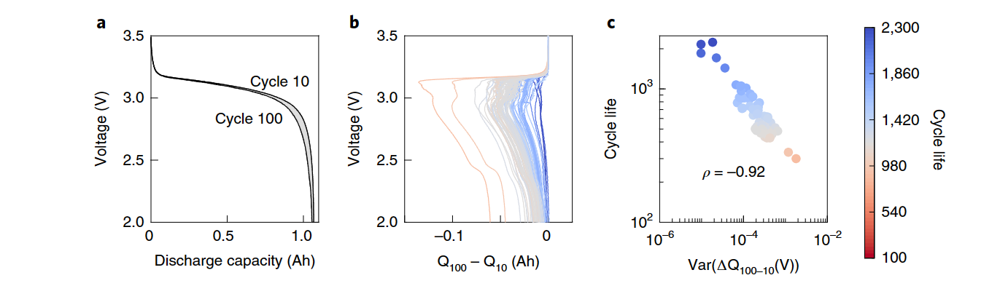
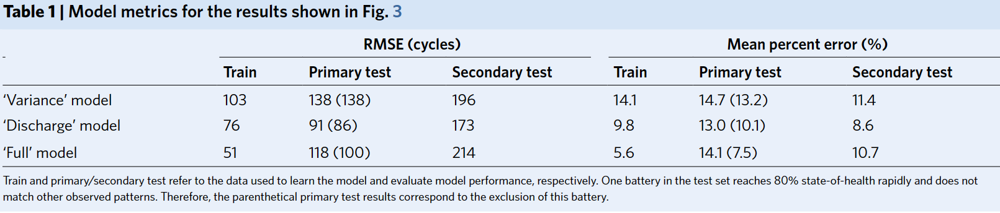

# Identifying degradation patterns of lithium ion batteries from impedance spectroscopy using machine learning 

### 23.5.12

zscore标准化：减去均值，除标准差

### 关于数据 集

 ox/red=1表示完全充电后的容量。ox/red=0表示放电后的容量。 

关于论文` Identifying degradation patterns of lithium ion batteries from impedance spectroscopy using
machine learning `

单温度模型：

`Capacity estimation`

```c
1. train_data: 25C01~25C04;
2. test_data: 25C05~25C08;

    容量针对起始容量进行归一化处理
```

`RUL prediction`

```c

```

多温度模型

`Capacity estimation`

```c
1. train_data : 25C01~25C04,35C01,45C01;->EIS_data
    EIS_data:1358*120 :
		/*[)
			＊ 1~201是25C01
        	＊ 201~381是25C02 
        	
        	* 381~451？
        	
        	＊ 451~652 是25C03 
        	
        	* 652~680？
        	
        	* 680~714 是25C04 
        	
        	* 714~761？
        	
        	* 761~1060  是35C01 
        	* 1060~1358 是45C01 
		*/


```


| 电池  | EIS_data_V循环次数 | Capacity_data循环次数 |       循环次数交集       |
| :---: | :----------------: | :-------------------: | :----------------------: |
| 25C02 |        250         |          180          |           180            |
| 25C01 |        261         |          349          |           261            |
| 25C03 |        229         |          201          |           201            |
| 25C04 |         81         |          34           |            34            |
| 35C01 |        327         |          326          |           326            |
| 45C01 |        299         |          299          |           299            |
|       |        1447        |         1389          | 1301（**EIS_data_new**） |


原始数据 是如何测量的：

**状态V：**充满电后静置15分钟

**电池**：12块45mAh Eunicell LR2032 锂离子纽扣电池，分别25，35，45温度下的气候室中循环，每个周期包括一个1C速率(45mAh)，CC-CV（恒流-恒压）充电到4.2V，一个2C (90mAh) CC（恒流）放电到3V

**EIS和Capacity**： 过在每个偶数次循环（偶数次循环通常是在电池充电或放电 达到稳定状态后进行的）中的充电/放电的九个不同阶段，以0.02 Hz至20 kHz的频率范围进行测量。测试时使用5 mA的激励电流，并在SoC为0%和100%时进行15分钟的开路测试，在每个奇数次循环后，测定容量损失。 

​	**开路测试：**将电池断开连接，观察电池在静止状态下的行为，通过完全放电 和完全充电状态下的开路测试，可	以确定电池的开路电压和内部自放电速率，这些 数据 可以用来评估电池的自放电特性和存储能量的损失情况

​	**关于直流和松弛条件的不同情况：**指在测试过程中采用不同充放电模式和时间，直流条件指恒定电流（5mA）	施加到电池中进行充电或放电，而松弛条件是指施加完电池后，等待一段时间以使电池达到稳定状态。

---

# Data-driven prediction of battery cycle life before capacity degradation 

## 名词解释

**标称容量**：标签上所称的容量，表示产品理论上的最大容量或额定容量

**电池寿命**：通常用循环次数来衡量，一个循环包含一个充电一个放电 

**电池产热**：是一个关于内部阻抗和充电策略的函数 

**放电容量**：电池在一次完全放电过程中能够释放的电能量(Ah,mAh)
	锂电在前100个循环中放电容量的衰减很小 ，在寿命末期放电容量的衰减加速

**使用机器预测电池寿命——机制不可知**
当衰变积累到一定程度（25%）后，利用积累的数据 开始预测工作
机器学习方法在高速率运行条件下很有吸引力，这时的第一性原理模型往往不可用
改进现有模型的方向：更高的精度 ，更早的预测，更大的可解释性以及更广泛地应用于广泛的循环条件


<center>fig1</center>
```markdown
# a/b: 颜色 表示 循环寿命，对于锂离子电池来说前100次容量的衰减很少，在寿命接近结束时（80%）加速衰减；容量与寿命之间相关性较弱

# c:  81%的电池在第100个循环时容量有所增加，电池的容量主要是通过电化学反应在正极和负极之间的电荷转移来实现的，但锂离子电池的负极在其表面或内部的某些区域往往可以存储比正极更多的电荷，这会在电池充放电过程中提供额外的容量 -> 容量与寿命之间的相关性 较弱

# -->> 基于容量衰减曲线的预测能力有限 
```




<center>fig2</center>
```markdown
# 基于放电曲线的一些特征图, 容量是电压的函数

# Q(V)描述给定电压下电池的放电容量
```

**三个模型**：
$$
\begin{align*}
& 1. 仅使用\Delta Q_{100-10}(V)的方差作为特征\\
& 2. 在1的基础上，使用了在放电过程获取的额外候选特征\\
& 3. 在前两个模型的基础上，使用 来自温度和内部电阻等额外数据流的特征
\end{align*}
$$




<center>三个模型的相关训练数据</center>

```markdown
# Primary test 和 Train 是同源的一块数据一分为二，Secondary test是独立的测试数据 ，所以对模型的要求更严格
```


<center>“低寿命”“高寿命”分类器</center>

```markdown
# 虚线之前表示训练数据，之后 表示开始预测

```


## **本文模型**

```markdown
# 数据驱动模型：使用早期循环数据准确 预测商用磷酸铁锂/石墨电池的循环寿命（未知降解机制的情况下）

1. cycle life / end of life : 标称容量的80%的循环次数

# 模型表现：
	1. 使用前100次循环数据容量预测误差为 9.1%
	2. 使用前5个循环数据，高低寿命组分类误差为 4.9%
	
# 确定数据特征/数据生成
	1. 在温度控制 的环境室中(30度)，在不同的快速充电条件(3.6C~6C)下，在相同的放电条件下(4C放电到2.0V)	
		1.1 石墨负极主导电池的降解，可以推广到其他负极为石墨的电池
	2. 数据集包括150~2300循环寿命的电池，平均寿命为806,标准差为377
	3. 评估电池寿命时，初始容量并不是一个决定性因素，
		3.1 及在早期 循环中容量几乎没有显示下降，甚至有时会增加，是因为：当电池经历缓慢的充放电循环或休息期		后，负极电极中的电荷在超出正极电极范围的区域中储存起来，这些储存的电荷可能会导致容量略微增加
		
    4. 生成特征并使用弹性网作为正则化框架：弹性网是一种线性回归模型，综合了L1,L2正则化项的影响
		4.1 L1：Lasso正则化可以促使模型产生稀疏解，使得部分特征的系数为0
		4.2 L2：岭回归，可以控制模型的复杂度，防止过拟合
		
#  [数据集](https://data.matr.io/1/projects/5c48dd2bc625d700019f3204)    
	1. 124个商业锂离子电池，APR18650M1A，温度30度，标称容量为1.1Ah,标称电压为3.3V
	2. 充电策略：C1(Q1)-C2,Q1是电流切换时的充电状态SOC,%,第二个充电状态在80%soc结束，随后充电1C,CC-CV
		电压上下限：3.6V，2.0V，all cells discharge at 4C
	3. 三个批次(batches)，每个batches 48个电池，批次按照测试日期来划分
	4. 内阻测量：在soc80%时用10个脉宽为30~33ms的正负3.6C脉冲的平均值测量

	
```

## 代码学习

**HDF5文件**：
	某些情况下，HDF5库和工具可能会自动生成索引键，如：`#refs#`用于存储引用链接或索引相关的数据 
	`#subsystem#`：包含与HDF5文件的结构和组织相关的信息

```markdown
# HDF5文件：
	1. #refs#
		group 100003members
		
	2. #subsystem#
		group 1members
			MCOS
		
	3. batch
		group 8members:Vdlin, barcode, channel_id, cycle_life, cycles, policy, policy_readable, 						  summary
		
		Vdlin:			dataset		shape(47,1)		type"|0"（对象类型）->可以是任意类型的对象
		barcode			dataset		shape(47,1)		type"|0"
		channel_id		dataset		shape(47,1)		type"|0"
		cycle_life		dataset		shape(47,1)		type"|0"
		cycles			dataset		shape(47,1)		type"|0"
		policy			dataset		shape(47,1)		type"|0"
		policy_readable	 dataset	 shape(47,1)	 type"|0"
		summary			dataset		shape(47,1)		type"|0"
		
			cycles->:	I	Qc	Qd	Qdlin	T	Tdlin	V	discharge_dQdV	t	(9)
			summary->:	IR	QCharge	QDischarge	Tavg	Tmax	Tmin	chargetime	cycle	(8)
		
	4. batch_date
		dataset shape(10,1), type "<u2>"(无符号2字节整数类型)
		
		
```

```
batch1: './Data/2017-05-12_batchdata_updated_struct_errorcorrect.mat'
batch2:  ./Data/2017-06-30_batchdata_updated_struct_errorcorrect.mat'
batch3.  ./Data/2018-04-12_batchdata_updated_struct_errorcorrect.mat'

to standardize the voltage-cpapcity data across cells and cycles, all 4C discharge curves were fitted to  a spline function and linearly interpolated.capacity was fitted as a function of voltage and evaluated at 1000 linearly spaced voltage points from 3.5V to 2.0V. thses uniformly sized vectors enables straightforward data manipulations such as subtraction.
```

