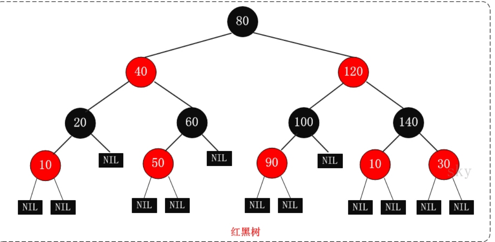

## 1.1 数据结构与算法

### 红黑树

#### 红黑树简介

`R-B Tree,Red-Black Tree`

红黑树的特性：

```markdown
1. 每个节点都是红或黑
2. 根节点是黑色
3. 每个叶子节点是黑色，这里的叶子节点指没有子节点且为空
4. 如果一个节点是红色的，则它的子节点必须是黑色的
5. 从一个节点到该节点的子孙节点的所有路径上包含相同数目的黑节点->没有一条路径会比其他路径长出两倍


红黑树是一种相对接近平衡的二叉查找树
```



<center>红黑树示意图</center>


#### 红黑树的应用

常用来存储有序数据 时间复杂度为`0(logn)`,如：`stl:set,map`,linux虚拟内存管理

#### 红黑树的时间复杂度及相关证明

时间复杂度：`0(logn)`

证明：一棵含有n个节点的红黑树的高度至多为2log(n+1)
$$
\begin{align}
&逆否命题：\textcolor{red}{高度为h的红黑树，它的包含的内节点个数至少为2^{h/2}-1个}\\ \\
&从某个节点出发，到达一个叶子节点的任意一条路径上，黑色节点的个数 称为该节点的黑高度，记为bh(x)\\ \\
&关于bh(x)\begin{cases}
1. 根据特性5：一个节点到该节点的子孙节点的所有路径上包含相同数目的黑节点->\textcolor{orange}{bh(x)是唯一的}\\
2. 根据特性4：红色节点的子节点必定是黑节点->\textcolor{orange}{bh(x)\geq h/2}
\end{cases}\\ \\
&综上即证：\textcolor{red}{高度为h的红黑树包含的黑节点个数至少为2^{bh(x)}-1}
\end{align}
$$


---


