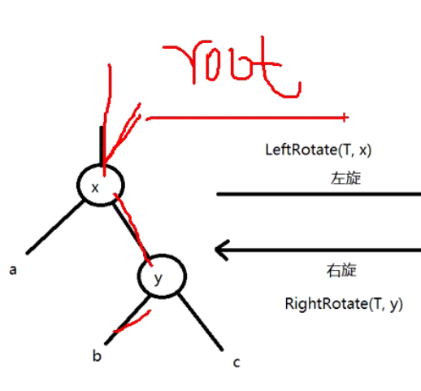

## 1.1 数据结构与算法

### 查找与排序（h3）

  

#### 冒泡排序

Bubble Sort


```cpp
void bubbleSort(vector<int> &a){
    
    int len = a.size();
    
    for(int i = 0; i < len-1; i++){ // 需要循环的次数
        
        for(int j = 0; j < len-1-i; j++){ // 要比较的个数 
            
            if(a[j] > a[j+1])
                swap(a[j],a[j+1]);
        }
    }
}
```


#### 选择排序  

如果 某个元素处在正确的位置，则它不会被 移动

```cpp
void selectSort(vector<int> &a){
    
    int len = a.size();
    
    for(int i = 0, minIndex; i < len - 1; j++ ){ // 需要循环次数
        minIndex = i;
        
        for(int j = i + 1; j <  len; j++){ // 访问未排序 的元素
            if(a[j]<a[minIndex])
                minIndex = j;
        }
        swap(a[i],a[minIndex]);
    }
}
```


#### 插入排序

构建有序序列，对于未排序数据，在已排序 序列中从后向前扫描，找到相应位置并插入

```cpp
void insertionSort(vector<int> &a){
    int len = a.size();
    
    for(int i = 0, j ; i < len-1; i++){
        j = i;
        temp = a[i+1];
        
        while(j>=0 && a[j] > temp){
            a[j+1] = a[j];
            --j;
        }
        a[j+1] = temp;
    }
}
```


#### 希尔排序 

非稳定排序，适合中小规模的数据 ，不适合大规模数据 

希尔排序 内嵌了一个插入排序 

```cpp
int shell_sort(int *data, int length){
    int gap = 0;
    int i = 0, j =0;
    int temp = 0;
    
    for(gap=length/2;gap>=1;gap/=2){
       
        for(i = gap; i<length; i++){ // 如果 这里是i+=gap,就变成插入排序 了
           	temp = data[i];
            
            for(j = i-gap; j >= 0 && temp < data[j]; j = j - gap){
                
                data[j+gap] = data[j];
            }
            data[j+gap] = temp;
            
        }
        
    }
    return 0;
}
```

#### 归并排序 

```cpp
void sort(int *data, int *temp, int start, int middle, int end){
    
    int i = start,j = middle+1, k = start;
    
    while(i <= middle && j <= end){
        if(data[i] > data[j]){
 			temp[k++] = data[j++];           
        }else{
            temp[k++] = data[i++];
        }
    } // 循环走完之后 ，i,j一定有一个到头，需要对剩下的可能数据进行处理
    
    while(i<=middle){
        temp[k++] = data[i++];
    }
    while(j<=end){
        temp[k++] = data[j++];
    }
    
    for(i = start; i<=end; ++i){ // 这里i<=end还是i<end
        data[i] = temp[i[];
    }
    
}
                       
int merge_sort(int *data, int *temp, int start, int end){
    
    int middle;
    if(start<end){
        middle = start + (end-start)/2;
        merge_sort(data, temp,  start,  middle);
        merge_sort(data, temp,  middle+1,  end);
        sort(data, temp, start, middle, end);
    }
}                       
      
                       
                       
```


#### 快排

```cpp
int sort(int *data, int left, int right){
    if(left>right) return -1;
    int i = left, j  = right;
    int key = data[left];
     
    while(i != j){
        while(i<j && key <= data[j]){ // i<j 少不了
            --j;
        }
        data[i] = data[j];
        while(i<j && key >= data[i]){
          	++i;
        }
        data[j] = data[i];
    }
    data[i] = key;
    
    sort(data, left, i-1);
    sort(data, i+1, right);
    return 0;
}

int quick_sort(int *data, int length){
    sort(data, 0, length-1);
}
```


#### 堆排序

**堆是一种数据结构 ，是一棵完全二叉树，且满足性质：所有非叶子节点均不大于或不小于左右孩子节点的值 **

[图解](https://www.cnblogs.com/chengxiao/p/6129630.html)

大顶堆：`arr[i] >= arr[2i+1] && arr[i] >= arr[2i+2]`
小顶堆：`arr[i] <= arr[2i+1] && arr[i] <= arr[2i+2]`

堆排序基本思想：将序列构造成大顶堆，将根节点和尾元素进行交换，循环

```cpp
void build_max_heap(vector<int> &vec, int len, int index){
    int right = 2*index + 2;
    int left = 2*index +1;
    int maxIndex = index;
    if(right<len && vec[right] > vec[maxIndex]) maxIndex = right; // right<len
    if(left<len && vec[left] > vec[maxIndex]) maxIndex = left;
    if(maxIndex != index){
        swap(vec[index],vec[maxIndex]);
        build_max_heap(vec, len, maxIndex);
    }
}

int heap_sort(vector<int> &vec, int len){
	for(int i = len/2-1; i>=0; --i){
        build_max_heap(vec, len, i);
    }
    for(int i = len-1; i>=1; --i){
        swap(vec[0],vec[i]);
        build_max_heap(vec, i, 0); // 再次构建 大根堆，长度发生变化 , i
    }
    return 0;
}
```


实现一个时间轮定时器


#### KMP算法

回溯的多少，与`共同前缀与后缀长度`多少有关 

```cpp
// 生成next数组 ，该数组纪录了模式串中每个位置的最长相同前缀和后缀的长度
void make_next(const char *pattern, int *next){
    int q, k;
    int m = strlen(pattern);
    
    next[0] = 0;
    
    for(q = 1, k = 0; q < m; ++q){ // for循环只有在pattern[q]==pattern[k]时才会真正开始执行
        while(k>0 && pattern[q] != pattern[k]){
            k = next[k-1]; // 回溯
        }
        if(pattern[q] == pattern[k]){ 
            ++k;
        }
        
        next[q] = k;
    }
}

// pattern --> "ababc"
	// next[0] == 0;
	// q=1, k=0, ptn[q]:ptn[k] = b:a; next[1] = 0;
	// q=2, k=0, ptn[q]:ptn[k] = a:a; ++k; next[2] = 1;
	// q=3, k=1, ptn[q]:ptn[k] = b:b; ++k; next[3] = 2;
	// q=4, k=2, ptn[q]:ptn[k] = c:a; k = 0; next[4] = 0;

int kmp(const char *text, const char *pattern){
    int n = strlen(text);
    int m = strlen(pattern);
    
    make_next(pattern,next);
    
    int i, q;
    for(i = 0, q = 0; i<n; i++){ // i遍历text,q遍历pattern
        while(q>0 && pattern[q] != text[i]){ // q大于0保证了next数组 有对应的值 ，不会下标越界
            q = next[q-1];
        }
        
        if(pattern[q] == text[i]){
            q++;
        }
        
        if(q == m){
            break;
        }
    }
    return i-q+1;
}
```


### 红黑树

#### 二叉排序树`BST`

二叉排序树/二叉查找树：左结点小于根结点 ，右结点大于根结点

*将数据结构和业务本身做一个分离：方便代码的维护，复用，可测试，团队协作*

```cpp
typedef int KEY_VALUE;

#if 0
struct bstree_node{
    KEY_VALUE data;
    struct bstree_node *left;
    struct bstree_node *right;
};

struct bstree{
    struct bstree_node *root;
};

#else
#define BSTREE_ENTRY(name, type)	  \
	struct name{					\
        struct type *left;			 \	
        struct type *right;			 \
    }

struct bstree_node{
    KEY_VALUE data;
    BSTREE_ENTRY(,bstree_node) bst;
};

struct bstree{
    struct bstree_node *root;
};

#endif

// 
struct sched{
    BSTREE_ENTRY(, bstree_node) ready;
    BSTREE_ENTRY(, bstree_node) defer;
    BSTREE_ENTRY(, bstree_node) sleep;
    BSTREE_ENTRY(, bstree_node) wait;
}

```


#### 红黑树简介


`R-B Tree,Red-Black Tree`

红黑树的特性：

```markdown
1. 每个节点都是红或黑
2. 根节点是黑色
3. 每个叶子节点是黑色，这里的叶子节点指没有子节点且为空
4. 如果一个节点是红色的，则它的子节点必须是黑色的
5. 从一个节点到该节点的子孙节点的所有路径上包含相同数目的黑节点->没有一条路径会比其他路径长出两倍


红黑树是一种相对接近平衡的二叉查找树
```


<center>红黑树示意图</center>
#### 红黑树的应用

常用来存储有序数据 时间复杂度为`0(logn)`,如：`stl:set,map`,linux虚拟内存管理

#### 红黑树的时间复杂度及相关证明

时间复杂度：`0(logn)`

证明：一棵含有n个节点的红黑树的高度至多为`2log(n+1)`

---

$$
\begin{align}
&逆否命题：\textcolor{red}{高度为h的红黑树，它的包含的内节点个数至少为2^{h/2}-1个}\\ \\
&从某个节点出发，到达一个叶子节点的任意一条路径上，黑色节点的个数 称为该节点的黑高度，记为bh(x)\\ \\
&关于bh(x)\begin{cases}
1. 根据特性5：一个节点到该节点的子孙节点的所有路径上包含相同数目的黑节点->\textcolor{orange}{bh(x)是唯一的}\\
2. 根据特性4：红色节点的子节点必定是黑节点->\textcolor{orange}{bh(x)\geq h/2}
\end{cases}\\ \\
&综上即证：\textcolor{red}{高度为h的红黑树包含的节点个数至少为2^{bh(x)}-1}\\
\\
& 利用数学归纳法证明：\\
&1. 当树的高度h=0时，内节点个数 为0，bh(x)为0，2^{bh(x)}-1也为0，原命题得证\\
&2. 当h>0时，且树的高度为h-1时，它包含的节点个数至少为2^{bh(x)-1}-1，这个 是根据1推断来的\\
& \quad 下面由树的高度为h-1的书籍条件推出“树的高度为h时，它所包含的节点树 为2^{bh(x)}-1" \\
& \quad 当树的高度为h时，对于根节点x黑高度为bh(x),对于节点x的左右树，它们黑高度为bh(x)或bh(x)-1\\
& \quad 已知高度为h-1的节点包含的节点至少为2^{bh(x)-1}-1\\
& \quad 所以节点x所包含节点至少为(2^{bh(x)-1}-1)+(2^{bh(x)-1}-1)+1=2^{bh(x)}-1\\
& \quad 原命题得证
\end{align}
$$


---


#### 红黑树左旋和右旋

红黑对在添加删除之后可能 就不是红黑树了，此时旋转使其变成红黑树

左旋:


```cpp
RIGHT-ROTATE(T, y)  
01  x ← left[y]             // 前提：这里假设y的左孩子为x。下面开始正式操作
02  left[y] ← right[x]      // 将 “x的右孩子” 设为 “y的左孩子”，即 将β设为y的左孩子
03  p[right[x]] ← y         // 将 “y” 设为 “x的右孩子的父亲”，即 将β的父亲设为y
04  p[x] ← p[y]             // 将 “y的父亲” 设为 “x的父亲”
05  if p[y] = nil[T]       
06  then root[T] ← x                 // 情况1：如果 “y的父亲” 是空节点，则将x设为根节点
07  else if y = right[p[y]]  
08            then right[p[y]] ← x   // 情况2：如果 y是它父节点的右孩子，则将x设为“y的父节点的左孩子”
09            else left[p[y]] ← x    // 情况3：(y是它父节点的左孩子) 将x设为“y的父节点的左孩子”
10  right[x] ← y            // 将 “y” 设为 “x的右孩子”
11  p[y] ← x                // 将 “y的父节点” 设为 “x”
```


右旋:


```cpp
/*
	* 将x的右孩子设为y的左孩子,将x的右孩子的父节点设为y
	* 将y的父节点设为x的父节点,随后分三种情况
	* 将y设为x的右孩子,y的父节点设为x
*/


RIGHT-ROTATE(T, y)  
01  x ← left[y]             // 前提：这里假设y的左孩子为x。下面开始正式操作
02  left[y] ← right[x]      // 将 “x的右孩子” 设为 “y的左孩子”，即 将β设为y的左孩子
03  p[right[x]] ← y         // 将 “y” 设为 “x的右孩子的父亲”，即 将β的父亲设为y
04  p[x] ← p[y]             // 将 “y的父亲” 设为 “x的父亲”
05  if p[y] = nil[T]       
06  then root[T] ← x                 // 情况1：如果 “y的父亲” 是空节点，则将x设为根节点
07  else if y = right[p[y]]  
08            then right[p[y]] ← x   // 情况2：如果 y是它父节点的右孩子，则将x设为“y的父节点的左孩子”
09            else left[p[y]] ← x    // 情况3：(y是它父节点的左孩子) 将x设为“y的父节点的左孩子”
10  right[x] ← y            // 将 “y” 设为 “x的右孩子”
11  p[y] ← x                // 将 “y的父节点” 设为 “x”
```

小结:


#### 红黑树-添加

1. 将红黑树当作一颗二叉查找树，将节点插入
   1. 着色和旋转的操作不会改变红黑树本身是二叉查找树的事实
2. 将插入的节点有着色为红色
   1. 着色为红色不会违背特性5，违背的特性越少，要处理的情况就越少，红黑树特性如下 ：
      1. 节点非黑即红，不会违背
      2. 根节点是黑色的，二叉查找树的添加操作不会以改变根节点，不会违背
      3. 空叶子节点为黑，插入非空节点不会对空叶子节点有影响，不会违背
      4. 红节点的子节点为黑，可能违背
      5. 从一个节点到该节点的子孙节点的所有路径上包含相同数目的黑节点，不会违背
3. 通过旋转或着色等操作使之重新成为一颗红黑树

```cpp
RB-INSERT(T, z)  					// T表示红黑树，z表示要插入的节点 
01  y ← nil[T]                        // 新建节点“y”，将y设为空节点。
02  x ← root[T]                       // 设“红黑树T”的根节点为“x”
03  while x ≠ nil[T]                  // 找出要插入的节点“z”在二叉树T中的位置“y”
04      do y ← x                      
05         if key[z] < key[x]  
06            then x ← left[x]  
07            else x ← right[x]  
08  p[z] ← y                          // 设置 “z的父亲” 为 “y”
09  if y = nil[T]                     
10     then root[T] ← z               // 情况1：若y是空节点，则将z设为根
11     else if key[z] < key[y]        
12             then left[y] ← z       // 情况2：若“z所包含的值” < “y所包含的值”，则将z设为“y的左孩子”
13             else right[y] ← z      // 情况3：(“z所包含的值” >= “y所包含的值”)将z设为“y的右孩子” 
14  left[z] ← nil[T]                  // z的左孩子设为空
15  right[z] ← nil[T]                 // z的右孩子设为空。至此，已经完成将“节点z插入到二叉树”中了。
16  color[z] ← RED                    // 将z着色为“红色”
17  RB-INSERT-FIXUP(T, z)             // 通过RB-INSERT-FIXUP对红黑树的节点进行颜色修改以及旋转，让树T仍然是一颗红黑树
```


|       | **现象说明**                                                 | **处理策略**                                                 |
| ----- | ------------------------------------------------------------ | ------------------------------------------------------------ |
| Case1 | 当前节点的父节点是红色，且当前节点的祖父节点的另一个子节点（叔叔节点）也是红色。 | (01) 将“父节点”设为黑色。 <br />(02) 将“叔叔节点”设为黑色。 <br />(03) 将“祖父节点”设为“红色”。<br />(04) 将“祖父节点”设为“当前节点”(红色节点)；即，之后继续对“当前节点”进行操作。 |
| Case2 | 当前节点的父节点是红色，叔叔节点是黑色，且当前节点是其父节点的右孩子 | (01) 将“父节点”作为“新的当前节点”。 <br />(02) 以“新的当前节点”为支点进行左旋。 |
| Case3 | 当前节点的父节点是红色，叔叔节点是黑色，且当前节点是其父节点的左孩子 | (01) 将“父节点”设为“黑色”。<br /> (02) 将“祖父节点”设为“红色”。<br /> (03) 以“祖父节点”为支点进行右旋。 |


#### 代码实现

```c
// 实现1： 缺点：不可复用，业务与红黑树的实现绑定在一起
typedef struct _rbtree_node{
   
    int key; // 
    void *value;
    
    // 这四行就是红黑树的定义
    struct _rbtree_node *right;
    struct _rbtree_node *left;
    struct _rbtree_node *parent;
    unsigned char color; // 该定义放在最后，为了更好的内存对齐，节省内存
    
} rbtree_node ;

typedef struct _rbtree{
    struct _rbtree_node *root;
    struct _rbtree_node *nil; // 方便后续判断 ，不能是NULL
} rbtree;

// 实现2：
typedef int KEY_TYPE;
// 将红黑树的性质封闭起来
define RBTREE_ENTRY(name, type)	    \
		struct name{			  \
            struct type *left;		\
		   struct type *right;   	\
            struct type *parent;	\
			unsigned char color; 	\	
        }
	
typedef struct _rbtree_node{
    KEY_VALUE key;
    void *value;
    RBTREE_ENTRY(, _rbtree_node);
} rbtree_node;

typedef struct _rbtree{
    struct _rbtree_node *root;
    struct _rbtree_node *nil; // 方便后续判断 ，不能是NULL
} rbtree;

```

旋转



```c
void rbtree_left_rotate(rbtree *T, rbtree_node *x){
    rbtree_node *y = x->right;
    // 1
    x->right = y->left;
    if(y->left != T->nil){
        y->left->parent = x;
    }
    
    // 2
    y->parent = x->parent;
    if(x->parent == T->nil){
        T->root = y;
    }else if(x = x->parent->left){
        x->parent->left = y;
    }else{
        x->parent->right = y;
    }
    
    // 3
    y_left = x;
    x->parent = y;
}
```

