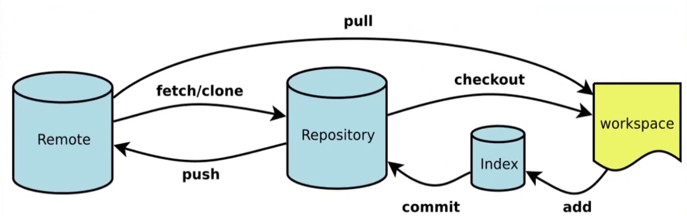
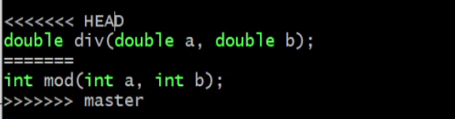

# 1.4.1 `Makefile/cmake/configure`

## `makefile`

#### **编译过程**：

1. 预处理`cpp`：添加相关头文件的内容，通常以`.i`作为文件扩展名
2. 编译`ccl`：转换成汇编语言，`.s`
3. 汇编`as`：将`.s`翻译成机器语言指令(二进制)，将指令打包成可重定位目标程序`(Object)`的格式，保存到`.o`文件
4. 链接`ld` ：链接后生成可执行文件


# 1.4.2分布式版本控制`git` 

## 远程连接

1. 在`linux`/服务器中创建远端仓库

   ```bash
   git init --bare  # --bare 创建裸仓库，不透露代码，安全
   ```

   

2. 在个人环境`如windows`，使用`ssh`与远端仓库建立链接

  ```bash
  # 在个人电脑 中创建ssh秘钥和公钥
   ssh-keygen -t rsa
   
  # 将公钥拷贝到服务器中，目录为：~/.ssh/authorized_keys
  ```

3. 从远端拉取代码

   ```bash
   git clone ssh://dai@192.168.1.1:/home/dai..

	# 拉取到本地之后 设置用户名和邮箱(在拉取的文件目录设置)
   git config user.name dai
   git config user.email  dai@1163.com 
   # 设置全局：
   	git config --global ...	
   	
   ```
   

 

## 逆向操作：

```bash
1. 从index回溯到workspace 
git restore -S file_name  
   
2. 从本地仓库repository回溯到index中
git reset --soft head^

从repository 回溯到workspace
git reset --mixed head^
git reset # 默认是git reset --mixed 

从repository删除
git reset --hard head^


3. workspace -> null,原理是将特定文件或目录恢复为最新提交的版本，覆盖当前工作区所做的更改
git checkout  . # 撤销所有未提交的更改
git checkout -f # 强制，忽略本地修改，覆盖内容
```

## 本地仓库整理操作

```bash
1. 整理上一次的提交，介于commit 和 push 之间，对之前的提交做了补充，并复用他的提交
git add file_name
git commit --amend

2. 整理多个提交,不要通过rebase对任何已经提交到公共仓库中的commit进行修改，个人分支除外 
git rebase -i HEAD~3 # 对最近的三个提交进行重新编辑
 
```

##  分支操作

``` bash
1. 查看分支
git branch

2. 创建分支
git branch [分支名]

git checkout [分支名] # 创建分支同时转移到创建的分支

3. 切换分支
git checkout [分支名] / git switch [分支名]

4. 合并分支  
git merge 

5. 删除分支
git branch -d develop
git push origin -d develop # 删除远端分支	
```

## 解决冲突



	1. 上半部分是本地的修改
 	2. 下半部分是master分支的修改

```bash
# 冲突产生原因：不同分支修改了相同文件的同一行或相邻行

1. 拉取代码
git pull

2. 把master 合并到develop
git checkout develop
git merge master

3. 处理冲突文件
4. 测试代码

5. 合并到master
git checkout master
git merge develop
git push origin master # 建议push前先pull检查最新代码
```

# `linux`系统运行时参数命令

## `linux`基础命令和工具

###  `grep`搜索字符

`grep`:在文件中执行关键字搜索

| 参数 | 作用                |
| ---- | ------------------- |
| -c   | 仅显示 找到的行数   |
| -i   | 忽略大小写          |
| -n   | 显示行号            |
| -v   | 反向搜索            |
| -r   | 递归搜索            |
| -C n | 打印匹配行的前后n行 |

```bash
# 在指定文件查找login关键词
grep login imUser.cpp 

 # 多文件查找 
grep login imUser.cpp MasgConn.cpp
grep login *.cpp

# 递归搜索目录下所有文件，打印出包含login的行
grep login -r msg_server/

# 查找文件中不包含login 的行
grep -v login imUser.cpp


```


### `find`查找文件

 通过文件名查找文件的所在位置，文件名查找支持模糊匹配
find [指定查找目录] [查找规则] [查找完后执行的action]
常用的操作：

```bash
find . -name FILE_NAME
find . -iname FILE_NAME 	# 忽略文件名称大小写
find /etc -maxdepth 1 -name passwd 	#查找/etc/下名称中带有passwd的文件，查找一层
find /mnt -size 20K 	#查找/mnt文件大小近似20k的文件
find /mnt -size +20K 	#查找/mnt文件大小大于20k的文件
find /mnt -size -20K 	#查找/mnt文件大小小于20k的文件
find /etc -maxdepth 2 -mindepth 2 -name .conf #	查找/etc/下名称中带有.conf的文件，且只查找第二层
find /mnt -type d 		#按type查找/mnt中目录
find /mnt -type f 	 	#按type查找/mnt中文件
find /mnt -cmin 10 		#查找/mnt中十分钟左右修改的
find /mnt -cmin +10 	#查找/mnt中十分钟以上修改的
find /mnt -cmin -10 	#查找/mnt中十分钟以内修改的
find /mnt -ctime 10 	#查找/mnt中十天左右修改的
find /mnt -ctime +10 	#查找/mnt中十天以上修改的
find /mnt -ctime -10 	#查找/mnt中十天以内修改的 
```

### `ls`显示文件

-`t` 可以查看最新修改时间 
`-l`每行显示一个条目
`-h`显示文件大小
`-R`递归显示   
`-n`显示组id 和gid 

练习：
ls -lt 按最新修改的时间排序，新修改的在前面显示。
ls -ltR 按最新修改的时间排序，新修改的在前面显示，并显示子目录的文件信息
ls -lh 以单位显示文件大小

### `wc`计算字数

 wc命令用于计算字数。 利用wc指令我们可以计算文件的Byte数、字数、或是列数，若不指定文件名
称、或是所给予的文件名为"-"，则wc指令会从标准输入设备读取数据。

语法
wc [选项] [文件]
参数：

* -c或--bytes或--chars 只显示Bytes数。
* -l或--lines 只显示行数。
* -w或--words 只显示字数。
* --help 在线帮助。
* --version 显示版本信息。

练习：

```bash
wc testfile # testfile文件的统计信息
7 92 607 testfile # testfile文件的行数为7、单词数92、字节数607 
```


## `CPU`性能监控

## 内存性能监控

## 文件`IO`性能监控

## 网络`IO`性能监控