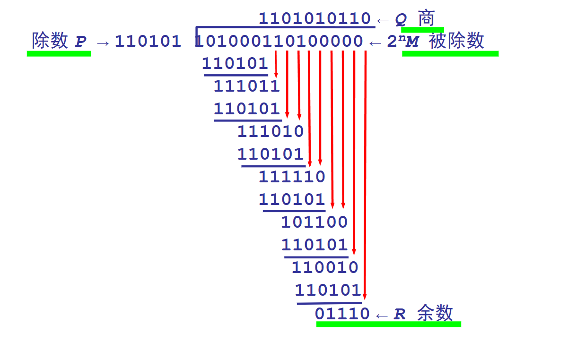

### 填空：

1. 双绞线的最高传输速率可达	<u>100Mbps</u>
   同轴电缆最高速率可达	<u>10Mbps</u>，
   光纤传输速率可达 	<u>1000Mbps或更高</u>
2. 局域网的拓扑中除了环形网还包括  <u>星形网络，总线网络，树形网络</u>
   特别的在环形网中有环形网中存在一个<u>干线耦合器</u>
3. 电子邮件系统采用了    <u>简单邮件传输协议SMTP</u>， 保证不同类型的计算机之间电子邮件的传送
4. 利用点分十进制记法将此二进制代码 10000000 00001011 00000011 00011111，写为一般的IP地址
    <u>128.11.3.31</u>
5. 当采用6bit编码时，发送窗口的最大值是      <u>2^6-1=63个数据包</u>
6. 假设两个时钟的相对频差为1×10−111×10−11,滑码一次增加或丢失的码元数为256bit，对2048kb/s的基群码流，最大可能的滑码速率为      <u>10.5kb/s</u>

------

### 名词解释

1. 分集复用分别表示什么？

   ```cpp
   1. 分集：分集是一种用于提高无线通信系统可靠性的技术，通过利用多个独立的信道来减少信号的衰落和干扰对通信的影响;
   2. 复用：复用是一种将多个信号或数据流合并在同一通信信道上进行传输的技术，它允许多个信号共享相同的传输介质以提高通信资源的利用率
   ```

   

2. 简述网关和路由的作用是什么？两者的区别是什么？

   ```cpp
   网关和路由的作用是确保数据能够在不同网络之间进行有效传输并找到最佳的路径；
   1. 网关可以连接不同网络，负责网络之间的连接和转换数据;
   2. 路由是决定数据包路径的过程，选择最佳路径将数据包从源地址传递到目标地址
   
   ```
   

   
3. 超文本标记语言`HTML`用于什么？

   ```cpp
   超文本标记语言（HTML）是一种用于创建和呈现Web页面的标记语言。HTML使用一系列标记来描述页面的结构和内容，例如标题、段落、链接、图片、表格等等。Web浏览器可以读取HTML文件，并将其转换为可视化的Web页面.
   ```
   
   

------

### 计算分析题

1. 假设待传送的数据M=1010001101(共kbit)，计算供差错检测用的nbit冗余码，设n=5，生成多项式P=110101

    ```cpp
    模2运算的结果是：商Q = 1101010110，余数R = 01110;
    将余数R作为冗余 码添加在数据 M的后面发送，即发送的数据是 101000110101110
    ```
    
    

   

2. 有10个站连接到以太网上，试计算以下三种情况下每一个站所能得到的带宽

    ```cpp
    1. 10个站连接到一个 10Mb/s以太网集线器
      根据CSMA/CD协议，每个站可获得的平均带宽为：10 Mb/s / 10 = 1 Mb/s
        
    2. 10个站都连接一一个 100Mb/s以太网集线器
      根据CSMA/CD协议，每个站可获得的平均带宽为：100 Mb/s / 10 = 10 Mb/s
        
    3. 10个站都连接到一个 10Mb/s以太网交换机
       交换机具有数据包转发和处理的能力，可以在不同端口之间建立虚拟电路，实现对带宽的分配和管理。因此，每个站都可以获得 10Mb/s的带宽。
    ```

    

3. 试说明10BASE_T中的10、BASE、和T所代表的意思

    ```cpp
    10BASE_T是一种以太网物理层标准，其中的 10代表数据传输速率为 10Mbps，BASE代表基带传输技术即将数字信号直接传输倒传输介质上，而不需要进行调制，T代表使用双绞线作为传输介质
    ```

    

4. 已知IP地址是141.14.72.24，子网掩码是255.255.192.0试求网络地址
   
    ```cpp
    1. 将地址和子网掩码转换为二进制形式：
       IP地址：  10001101.00001110.01001000.00011000
       子网掩码： 11111111.11111111.11000000.00000000
    2. 将ip地址和子网掩码进行逻辑与运算，得到网络地址
       网络地址： 10001101.00001110.01000000.00000000
    3. 将网络地址转换回十进制形式，得到最终的结果
       网络地址： 141.14.64.0
    ```
    

    
 5. 10.0.0.0/10中下划线10的含义是什么？

    ```cpp
    10.0.0.0/10中下划线10 隐含地指出IP地址 10.0.0.0的掩码是 255.192.0.0
        此掩码可表示为 11111111 11000000 00000000 00000000
    掩码中有10个连续的1
    ```

    
    
    


6. 更新A，B，E路由器的路由表：

|  A   |      |      |  B   |      |      |  E   |      |      |
| :--: | :--: | :--: | :--: | :--: | :--: | :--: | :--: | :--: |
|  1   |  1   |  -   |  1   |  2   |  A   |  1   |  1   |  -   |
|  2   |  1   |  -   |  2   |  2   |  A   |  2   |  2   |  A   |
|  3   |  1   |  -   |  3   |  1   |  -   |  3   |  2   |  A   |
|  4   |  2   |  B   |  4   |  1   |  -   |  4   |  3   |  A   |
|  5   |  2   |  D   |  5   |  3   |  C   |  5   |  1   |  -   |
|  6   |  3   |  B   |  6   |  2   |  C   |  6   |  2   |  F   |