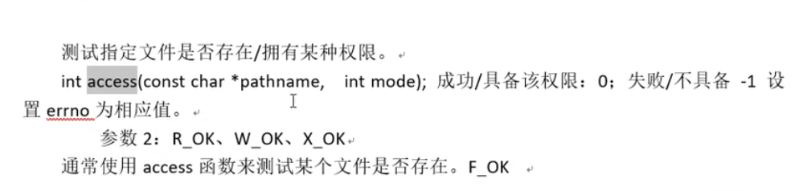

  

# 杂项

## 修改前缀

修改~/.bashrc文件中的PS1即可。
	如：` PS1='\[\033[1;32m\]\u@\h:\w\$\[\033[0m\] ' `

**`ip`地址**：`47.113.150.236`

## `linux`文件类型

占用磁盘资源的：

1. 普通 文件
2. 软链接
3. 目录

不占用磁盘空间的伪文件：

1. 字符设备
2. 块设备 
3. 管道
4. 套接字

# linux命令操作


## 基本命令和Shell脚本编程

```bash
ls 		# 列出当前目录所有文件和目录
ls -l 	# 更加详细 == ll
ls -a 	# 展示隐藏文件
ls -d  	# 显示目录
ls -la 

cd 			# 进入目录
cd .. 		# 进入上一层目录
cd ../.. 	# 进入上二层目录
cd - 		# 返回刚才的目录

pwd 	# 打印当前路径

date	# 显示 日期与时间
cal		# 显示日历
bc		# 计算器 ，默认输出整数
	scale=3		# 调整输出精度
	quit		# 退出 bc

cat		# 查看文件内容
head 	# 想看文件开头内容
head --lines=2 README.md # 查看文件开头二行
tail	# 查看尾部内容 ,也有--lines的用法
less	# 查看全文
more	# 和less差不多，在linux中只有向下翻页 
file 	# 查看文件格式等信息
where gcc #查看gcc的位置

echo	# 打印


# shell的for循环
# 如当前目录有week01~week05等文件，批量将week修改为chapter，序号不变
for ff in week??
> do 
> mv $ff chapter${ff#week} # '#'去头操作，'%'去尾操作
> done
# 没有撤销操作要小心，可以先echo打印看看，再操作
```


 


## 快捷键/热键

```bash
1. [tab] # 命令补全，文件补全
	ca[tab][tab] # 显示所有ca开关的命令
	
2. [ctrl]+c # 终止当前指令
3. [ctrl]+d # 键盘输入结束 ，= exit

4. [ctrl]+a # 在命令行中光标至开头
5. [ctrl]+e # 在命令行中光标至结尾
5. [ctrl]+u # 清空当前命令行

6. [shift]+[pageup],[shift]+[pageup] # 翻页

	
```


## 帮助说明 `man` `help`,`info`

1. 知道某个指令，忘记了相关选项与参数，使用`--help`查询 
2. 有任何不知道的指令或文件格式，使用`man`和`info`来查询 
3. 关于一些服务的说明文档，在`/usr/share/doc`

```bash
command --help # 查看命令的帮助文档
man date 	# 更详细的内容说明	 
进入man page 页面后的操作：
	[空格] # 下翻 
	[page up],[page down] # 翻页
	[home]	# 去到第一页
	[end]	# 去到最后一页
	/string # 向下搜索string 
	?string # 向上搜索string  // 利用?或/搜索字符串时，用n,N向下向上搜索
	q	# 离开
	

```

| man page页面的数字标号说明 |                                                              |
| -------------------------- | ------------------------------------------------------------ |
| 数字 标号                  | 代表内容                                                     |
| **1**                      | **用户在`shell`环境下可以操作的指令或执行文件**              |
| 2                          | 系统核心可呼叫的函数与工具等                                 |
| 3                          | 一些常用的函数或函数 库，大部分为c的函数库                   |
| 4                          | 装置文件的说明，通常在/dec下的文件                           |
| **5**                      | **配置文件或者 是某些文件的格式**                            |
| 6                          | 游戏(games)                                                  |
| 7                          | 惯例与协议等，例如linux文件系统，网络协议，`ASCII code`等等的说明 |
| **8**                      | **系统管理员可用的管理的指令**                               |
| 9                          | 和`kernel`有关的文件                                         |


| man page页面的内容说明 |                                                |
| ---------------------- | ---------------------------------------------- |
| NAME                   | 简短的指令数据 名称说明                        |
| SYNOPSIS               | 语法说明                                       |
| DESCRIPTION            | 较为完整的说明                                 |
| OPTIONS                | 针对 SYNOPSIS部分可选参数的说明                |
| COMMANDS               | 程序执行时可执行的选项                         |
| FILES                  | 这个程序或数据所使用或参考或连接到的某些文件   |
| SEE ALSO               | 可以参考的，跟这个 指令或数据 有相关的其他说明 |
| EXAMPLE                |                                                |
|                        |                                                |


关于`info page`

| 按键        | 进行工作                                    |
| ----------- | ------------------------------------------- |
| 空格键      | 下翻一页                                    |
| [page down] | 下翻一页                                    |
| [page up]   | 上翻一页                                    |
| [tab]       | 在node之间移动，有node的地方，通常会以*显示 |
| [enter]     | 当光标在node上面时，按下enter可以进入该node |
| b           | 光标移动到该info画面当中的第一个node处      |
| e           | 移动光标到该info画面当中的最后一个node片    |
| n           | 前往下一个node处                            |
| p           | 前往上一个node处                            |
| u           | 向上移动一层                                |
| s(/)        | 在info page 当中进行搜寻                    |
| h,?         | 显示 求助选单                               |
| q           | 结束 这次的info page                        |


## SSH

**安装ssh服务端**

```bash
sudo apt updata
sudo apt install openssh-server -y
sudo systemctl status ssh # 查看状态
sudo ufw allow ssh # 应对防火墙
```


**连接**

```bash
ssh username@ip  # 基本ssh 连接方法

# 给ip地址取别名，10.22.75.177是ip地址
sudo vim /etc/hosts -> 10.22.75.177 name 

ssh username@ipname
```

进一步的简化

```bash
vim ~/.ssh/config
	Host l1
	HostName linx
	Port 22
	User dai
	
# 连接
ssh l1
```


## 关于`linux`正确的关机方法

1. 观察系统的使用状态

   ```bash
   who # 查看在线使用人员
   netstat -a # 查看网络的联机状态
   ps -aux # 查看背景执行的程序 
   ```

2. 通知在线使用者关机的时刻

   ```bash
   # 使用shutdown的特别指令，给在线的使用者一些时间结束他们的工作
   ```

3. 正确的关机指令使用

   ```bash
   shutdown , reboot
   ```

其他相关指令：

1. `sync`：

   ```bash
   sync # 数据同步写入磁盘
   ```

   


# vim

## 基本操作/vi

### **移动光标**：

1. h(左移) 	j(下移)	k(上移)	l(右移)
2. 多次移动: `30j`向下移动30次
3. 屏幕向下/向上移动一页 `[ctrl]+[f]  /  [ctrl] + [b]`半页是`u/d`
4. 移动到行首/行尾：`0,$`
5. 移动到第一行,最后一行`gg,G`
6. 移动到n行：`nG`
7. 向下移动n行：`n[enter]`

### **搜索与代替**

1. 向光标之下寻找一个名为`word`的字符串：`/word`
2. 向光标之上寻找一个名为`word`的字符串：`?word`
3. 继续向下搜索：`n`，继续 向上搜索：`N`
4. 在某个范围内找到字符串并替换：`:n1,n2s/word1/word2/g`
   例 ：从第一列到最后一列寻找word1字符串，并将该字符串取代为word2，在取代前提示
   `:1,$s/word1/word2/gc` 
5. 替换通篇：`:%s/word1/word2/g`

### **删除，复制，粘贴 **

1.  向前删除：`X(当前光标覆盖的不会删除)`,向后删除：`x(删除当前光标所覆盖)`,多删`nx/nX`

2. 删除光标所在行：`dd`

3. 删除从光标开始的n行：`nd`

4. 删除光标所在行到第n行的数据 ：`dnG`

5. 删除光标所在行到最后一行的数据 ：`dG`

6. 删除光标处到行首的字符 ：`d0`

7. 删除光标和到行尾的字符 ：`d$`

   ---

8. 复制光标所在行：`yy`

9. 复制光标向下的n行：`nyy`

10. 复制光标所在行到第n行的所有数据 :	`ynG`

11. 复制光标所在行到最后一行的数据 ：`yG`

12. 复制光标所在处到行首：`y0`

13. 复制光标所在处到行尾：`y$`

    

    ---

14. 粘贴到上一行：`P`,粘贴 到下一行：`p`

15. 将光标所在行与下一行合并：`J`，有空格分隔

16. 撤销操作：`u`,反撤销：`[ctrl]+r`（关于ctrl + r 其实我不太懂）

17. 重复操作：`.`

    

### **进入插入或取代的编辑模式**

1. 进入插入模式：`i(从目前光标处插入)，I(在目前所在行的第一个非空格符处开始插入，也就是在开头插入)`

2. 进入插入模式：`a(从光标所在的下一个字符处开始插入)，A(从光标所在行的最后一个字符处开始插入)`

3. 进入插入模式：`o(从下一行开始插入)，O(从上行开始插入)`

4. 进入取代模式：`r(只会取代光标所在的字符一次),R(一起取代光标所在的字符，直到[ESC])`

   

### **指令行命令**

1. 将编辑的数据另存新档：`:w [filename]`
2. 读入另一个文件的数据，加到当前行的后面：`:r [filename]`
3. 将n1到n2的数据 存储到`filename`文件：`:n1,n2 w [filename]`
4. 执行`shell`命令`:!command`
5. 显示 行号，取消行号：`set nu / set nonu`

## 多文件编辑

1. 编辑下一个文件：`:n`，编辑上一个文件：`:N`

2. 列出vim开启的所有文件：`:files`

   

   

## 多窗口编辑

1. 开户一个新的窗口：`sp(垂直方向)，vs（水平方向）`
2. 切换窗口：`[ctrl]+w+j/k 向下切换窗口/向上切换窗口`


## vim的补全功能

1. 根据当前文件的数据为基础作补全：`[ctrl]+x -> [ctrl]+n`

2. 以扩展名作业语法补充，以vim内建的关键词予以补全：`[ctrl]+x -> [ctrl]+o`

   

## vim环境设定与记录：`~/.vimrc`, `~/.viminfo`

1. 设定/取消行号：`set nu / set nonu`
2. 高亮度搜索：`set hlsearch / set nohlsearch`
3. 自动缩排：`set autoindent / set noautoindent`
4. 语法检验：`syntax on/off`
5. 设置颜色色调：`set bg=dark/light`


关于`.vimrc`

```bash
autocmd # 自定义函数脚本


```


# git相关：
### 为git添加key
1. 设置git的username和useremail
```Git
$ git config --global user.name "dai_linux"
$ git consig --global user.email "dai_linux.email"
```
2. 生成密钥

    `ssh-keygen -t rsa -C "dai_linux.email"`
3. 复制公钥在github中添加即可


# 系统编程

https://www.bilibili.com/video/BV1KE411q7ee/?spm_id_from=333.999.0.0&vd_source=c4b85f17ebb9ce2f43461cac3ae9756e


## gcc编译4步骤


编译阶段逐行检查代码，最耗时

**链接**：

地址回填


 数据段合并（节省空间）


**`gcc`常用参数：**

1. `-I ` 指定头文件，适用于当源码和头文件不在同一目录下，处于同一目录下时，可省略`-I`
2. `-c`：只做预处理，编译，汇编，得到二进制文件
3. `-g`：编译时添加调试文件
4. `-Wall`：显示 所有警告信息
5. `-D`：在程序 中注册一个宏  如`gcc -c hello.c -o hello -D HELLO`,可以用来作调试信息的开关


## 动态库和静态库

**静态库和动态库（共享库）的区别**：动态库动态调用速度理论上慢一些，现在已经很很快了

​	静态库：适用于对空间要求低，对时间要求高的核心程序 中，如操作系统 的启动进程

​	动态库：适用于对时间要求低，对空间要求高


### 静态库的制作和使用

**制作：**

`ar rcs libmylib.a file1.o` 

* 静态库库名要求以`lib`开头，`.a`结尾，`mylib`可以修改

```bash
1. 生成.o文件
gcc -c add.c -o add.o
...

2. 使用ar工具制作静态库
ar rcs libmymath.a add.o sub.o div1.o 
```

**使用：**

```bash
# 和源码一起编译
gcc  test.c lib库名.a -o a.out
```

会警告隐式声明，需要做静态库的头文件对应,在源码中包含头文件`#include "mymath.h"`

```c
// mymath.h
#ifndef _MYMATH_H_
#define _MYMATH_H_
int add(int, int);
int sub(int, int);
int div1(int, int);
#endif
```


### **动态库的制作和使用**：

**制作**：

1. 生成.o文件,生成与位置无关的代码，`-fPIC`

   ```bash
   gcc -c add.c -o add.o -fPIC
   ```

2. 使用`gcc -shared`制作动态库

   ```bash
   gcc -shared -o lib库名.so add.o ...
   ```

   

**使用**：

编译可执行程序 时，指定所使用的动态库， `-l(指定库名) -L(指定库路径)`

```bash
gcc test.c -o a.out -lmymath -L./lib  -I ./include
```

报错：找不到动态库,原因：

​	链接器：工作于链接阶段， 工作时需要 `-l -L` 

​	动态链接器：工作于程序 运行阶段，工作时需要提供动态库所在目录位置，通过环境变量:

​							` export LD_LIBRARY_PATH=./lib`解决问题，但随着退出终端进程消失，设置失效，进一步的修改bashrc							文件（终端配置文件）

```bash
vi ~/.bashrc
	export LD_LIBRARY_PATH=./lib 
source .bashrc
```


## `gdb(gcc debug)`工具

基础指令

```bash	

gdb a.out # 打开调试信息

list 1 # 从第一行开始查看源码 ， l 继续显示 

b/break 52 # 设置断点在52行，delete删除断点

run/r # 运行程序 到断点所在行（断点处尚未执行）

n/next  s/setp # 如果是函数 ，s会进入函数体内，n 不会

 p/print i # 使用p查看变量i的值 
 
 continue # 执行到下一个断点
 
 quit # 退出
```

其他指令

```bash
run # 直接使用run查找 错误出现位置

start # 直接使用start ，开始单步执行，n/s执行下一步,s进入函数时，可用finish 退出 ，start显示出来内容是还没有执行的语句 

finish # 结束 当前 函数调用，返回到函数调用点

 # 如果 main函数 是带有参数的,如：int main(arg[]);,可在gdb中直接使用set或run设置
 set args 	aa bb cc dd
 start
 或
 list 1 
 b 41
 run 		aa bb cc dd
 
 # 查看断点信息表：
 info b
 
 # 设置条件断点,用于循环/递归/嵌套中
 b 20 if i = 5
 
 # 查看变量类型
 ptype i 
 
 # 列出当前 程序 正存活着的栈帧
 backtrace/bt 
 # 根据编号切换 栈帧
 frame/f
 
 # 设置追踪变量
 display 变量名
 undisplay 编号 # 取消追踪
 
```


## 文件io


### 系统 函数 /系统调用

####   `open/close`

```c
// flags: O_RDONLY, O_WRONLY, O_RDWR, O_APPEND, O_CREAT, O_EXCL(是否存在), O_TURNC, O_NONBLOCK(非阻塞)
// mode_t mode 指定文件权限，在创建文件时会用到
int open(const char *pathname, int flags);
int open(const char *pathname, int flags, mode_t mode);

```

例：

```c
#include <unistd.h>
#include <fcntl.h> // 服务于O_RDONLY
#include <stdio.h> 
#include <errno.h>
#include <string.h> // 服务于strerror

int main(){
	int fd;
	fd = open("./dai.text", O_RDONLY); // 打开已有文件不需要第三个参数来指定文件权限
	
	// 如果 文件存在，以只读方式打开并截断成0，如果不存在，创建并指定文件权限为0644,1x,2w,4r
	// 创建文件时访问权限 = mode & ~umask(775) 
	int fd2 = open("./GG_.text", O_RDONLY | O_CREAT | O_TRUNC, 0644); // rw-r--r--

	int fd3 = open("./GGGG.txt", O_RDONLY);

	printf("fd = %d\n", fd);
	printf("fd2 = %d\n", fd2);
	printf("fd3 = %d, erron = %d:%s\n", fd3, errno, strerror(errno));

	close(fd);   
	close(fd2);
	return 0;
}

```


#### `read`函数 

`ssize_t read(int fd, void *buf, size_t count);`
	`fd`:文件描述符
	`buf`：存数据的缓冲区（临时存放数据 的区域）
	`count`：缓冲区的大小
	返回值 ：成功（返回读到的字节数，0表示读完）；失败（-1，设置errno） 

#### `write`函数

` ssize_t write(int fd, const void* buf, size_t count);`
	`fd`：文件描述符
	`buf`：待写出数据 的缓冲区
	`count`：数据 大小
	返回值 ：成功（写入的字节数），失败（-1，设置errno）【如果 返回-1且error=EAGIN或EWOULDBLOCK，说明不是					read失败，而是read在以非阻塞方式读一个设备文件或网络文件，并且文件无数据 】

#### **文件描述符**：

PCB进程控制块，本质 是一个结构体，体内有一个指针指向文件描述表


 其中0~2号分别是：`STDIN_FILENO,STDOUT_FILENO,STDERR_FILENO`,默认打开表中编号 最小的

文件


#### 作业：实现cp拷贝文件

实现1：系统函数 `read`,`write`

```c
#include <stdio.h>
#include <stdlib.h>
#include <string.h>
#include <unistd.h>
#include <pthread.h>
#include <fcntl.h>


int main(int argc, char *argv[]){

    int fd1 = open(argv[1], O_RDONLY);
    if(fd1 == -1){
        perror("open argv1 error");  // 等同于printf + strerror()
        exit(1);
    }
    int fd2 = open(argv[2], O_RDWR | O_CREAT | O_TRUNC, 0644);
    if(fd2 == -1){
        perror("open argv2 error"); 
        exit(1);
    }

    char buf[1024]; // 设置缓冲区大小
    int n = 0; // read函数 的返回值 ，即读取到的字节数
    while((n=read(fd1, buf, 1024)) != 0){
        if(n < 0){
            perror("read error");
            break;
        }

        write(fd2,buf,n);
    }

    close(fd1);
    close(fd1);

    return 0;
}
```

实现二：`fgetc`,`fputc`(c库函数的版本)

```c
#include <stdlib.h>
#include <stdio.h>

int main(void){

    FILE *fp, *fp_out;
    fp = fopen("dict.txt", "r");
    if(fp == NULL){
        perror("fopen1 error");
        exit(1);
    }

    fp_out = fopen("dict.cp", "w");
    if(fp_out == NULL){
        perror("fopen2 error");
        exit(1);
    }

    int n;
    while((n=fgetc(fp))!= EOF){
        fputc(n,fp_out);
    }
    fclose(fp);
    fclose(fp_out);

    return 0;
}
```


**问题**：c函数 版本更快，比系统 调用更快，因为`fputc`每次4096
	从用户空间到内核空间非常耗时，`fputc`有一个默认的缓冲区，存够4096个字节再到内核，而系统调用没有这个机制，会根据用户设定的字节大小访问内核，该大小如果 较小 ，就会多次访问内核耗时


<center >预读入缓输出</>


#### 阻塞与非阻塞

产生阻塞的场景：读设备文件，网络文件，常规文件无阻塞

阻塞是设备文件和网络文件的属性，不是函数的属性

设备文件如：`/dev/tty -- 终端文件`

```c
#include <stdlib.h>
#include <stdio.h>
#include <errno.h>
#include <unistd.h>
#include <string.h>
#include <fcntl.h>

int main()
{

    int fd, n;
    char buf[10];

    fd = open("/dev/tty", O_RDONLY | O_NONBLOCK);
    if(fd<0){
        perror("open /dev/tty");
        exit(1);
    }

    tryagain:

        n = read(fd, buf, 10);
        if (n < 0)
        {
            if (errno != EAGAIN)
            {
                perror("read /dev/tty");
                exit(1);
            }else{
                
                write(STDOUT_FILENO, "try again\n", strlen("try again\n"));
                sleep(2);
                goto tryagain;

            }
        }

        write(STDOUT_FILENO, buf, n);
        close(fd);


    return 0;
}
```


#### `fcntl`函数 

`int flags = fcntl(fd, F_GETFL);`
	`F_GETFL`：获取 文件状态
	`F_SETFL`：设置文件状态


将文件设置为非阻塞状态

`flags |= O_NONBLOCK;`
`fcntl(fd, F_SETFL, flags);`


#### `lseek`函数 

`off_t lseek(int fd, off_t offset, int whence);`

参数：

1.  `fd`：文件描述符
2. `offset`：偏移量
3. `whence`：起始偏移量：，`SEEK_SET/SEEK_CUP/SEEK_END`

返回值 ：

1. 成功：返回偏移量
2. 失败：-1，`errno`

应用场景：

1. 文件的读写使用同一偏移位置
2. 使用lseek获取`int length = lseek(fd, 0, SEET_END);`
3. 拓展文件大小`int addsize = lseek(fd, 111, SEET_END);`,
   注意：要想使文件大小真正拓展，必须引起`Io`操作,如下图，`lseek`增加110，写入`a`再加1，总共扩展容量为111
4. 关于扩展文件大小一个常用函数 ：`int ret = truncate("/daict.cp", 250);`，成功返回0失败返回-1


文件的读写使用同一偏移量：

```c
#include <stdlib.h>
#include <stdio.h>
#include <unistd.h>
#include <fcntl.h>
#include <string.h>

int main(){

    int fd,n;
    char msg[] = "this is a test for lseek\n";
    char ch;

    fd = open("lseek.txt", O_RDWR | O_CREAT, 0644);
    if(fd<0){
        perror("open lseek.txt error");
        exit(1);
    }

    write(fd, msg, strlen(msg));

    lseek(fd, 0, SEEK_SET); // 文件读写位置在同一位置，需要重置偏移量

    while((n=read(fd, &ch, 1))){  // read函数的第二个参数是指向缓冲区的指针，所以这里需要取地址
        if(n<0){
            perror("read error");
            exit(1);
        }
        write(STDOUT_FILENO, &ch, n);
    }

    close(fd);


    return 0;
}
```


#### 传入参数/传出参数

传入参数：

1. 指针作为函数参数
2. 通常有`const`关键字修饰
3. 指针指向有效区域，在函数内部作读操作

传出参数：

1. 指针作为函数参数
2. 在函数 调用之前 ，指针指向的空间可以无意义，但必须有效
3. 在函数 内部作写操作
4. 在函数 调用结束后，充当函数返回值 

传入传出参数：

1. 指针作为函数参数
2. 在函数调用之前 ，指针指向的空间有实际意义
3. 在函数 内部，先做读操作，后做写操作
4. 函数调用结束 后，充当函数返回值 


### 文件系统 

#### 文件存储


一个文件有文件目录项`dentry`和`inode`两部分组成，inode节点引用计数为0不会删除其指向的磁盘空间内容，磁盘内容只会被 覆盖不会被 删除

#### `stat`函数 

`int stat(const char *path, struct stat *buf);`

参数：

1. `path`
2. `buf`：（传出参数） 存放文件属性

返回值 ：

1. 成功：0

2. 失败：-1 errno

   

获取文件大小：`buf.st_size`
获取文件类型：`buf.st_mode`
获取文件权限：`buf.st_mode`


```c
#include <stdlib.h>
#include <stdio.h>
#include <unistd.h>
#include <fcntl.h>
#include <string.h>
#include <sys/stat.h>

int main(int argc, char *argv[]){

    struct stat sbuf;

    int ret = stat(argv[1], &sbuf); // int ret = lstat(argv[1], &sbuf);
    if(ret < 0){
        perror("stat error");
        exit(1);
    }
    // 获取文件大小
    printf("file size:%ld\n", sbuf.st_size); // st_size是long int 型
    // 利用宏函数 判断文件类型
    if(S_ISREG(sbuf.st_mode)){
        printf("this is a regular\n");      // 普通 文件
    }else if(S_ISDIR(sbuf.st_mode)){
        printf("this is a dir");            // 目录````
    }else if(S_ISFIFO(sbuf.st_mode)){
        printf("this is a pipe\n");         // 管道
    }else if(S_ISLNK(sbuf.st_mode)){
        printf("this is a sym link\n");     // 软链接
    }
    return 0;
}
```

#### `lstat`函数 

`stat`会穿透符号链接，`lstat`不会

如对于一个软链接

`int ret = stat(argv[1], &sbuf);`打印结果是常规文件

`int ret = lstat(argv[1], &sbuf);`打印结果是软链接


关于文件权限说明：`st_mode`


#### `access`函数 



#### `chmod`函数 


#### `link`函数 

创建一个文件的目录项

`unlink`函数 ：删除一个文件的目录项

利用`link+unlink`实现mv

```c
link(argv[1],argv[2]);
unlink(argv[1]);
```


`unlike`**函数特征**：清除文件时，如果文件的硬链接数为0，没有`dentry`对应，但该文件仍不会被 马上被 释放掉，要等到所有打开该文件的进程关闭该文件，系统 才会挑时间将该文件释放掉（覆写）


#### 隐式回收

当进程结束运行时，所有该进程打开的文件会被 关闭，申请的内存空间会被释放


#### `readlink`函数 

读取符号链接本身内容

`ssize_t readlink(const char *path, char *buf, size_t bufsiz);`成功返回读到的字节数，失败：-1(`error`)

`shall` 中直接`readlink 链接名`


#### `rename函数 `

`int rename(const char *oldpath, const char *newpath);`成功：0；失败：-1(`errno`)


### 目录操作


#### 文件/目录权限 

目录也是 文件，目录中的文件名叫作目录项（主要是文件名和`inode`两部分）


#### `getcwd`函数 

获取进程当前工作目录

`char *getcwd(char *buf, size_t size);`成功`buf`保存当前 工作目录位置，失败返回`NULL`


#### `chdir`函数

改变当前进程的工作目录

`int chdir(const char *path);`成功返回0，失败-1(`errno`)


#### `opendir`函数

打开一个目录（库函数 ）,`DIR *类似于FILE *`

`DIR * opendir(const char *name);`成功返回指向目录结构体的指针，失败返回`NULL`


#### `closedir`函数

关闭打开的目录

`int closedir(DIR * dirp);`成功返回0，失败返回-1（`errno`）


#### `readdir`函数

读取目录(库函数)

`struct dirent *readdir(DIR *dirp);`成功返回目录项结构体指针；失败返回`NULL`,(errno)


实现`ls`

```c
#include <stdlib.h>
#include <dirent.h>
#include <stdio.h>
#include <unistd.h>
#include <string.h>

int main(int argc, char *argv[]){

    DIR *dp;
    struct dirent *sdp;

    dp = opendir(argv[1]);
    if(dp == NULL){
        perror("open dir error");
        exit(1);
    }    

    while((sdp = readdir(dp))!=NULL){
        if((strcmp(sdp->d_name,".")==0) || (strcmp(sdp->d_name,"..")==0)){
            continue;
        }
        printf("%s\t", sdp->d_name);
    }
    printf("\n");

    closedir(dp);

    return 0;
}
```

#### `ls-R`作业

```c
#include <stdlib.h>
#include <stdio.h>
#include <fcntl.h>
#include <string.h>
#include <dirent.h>
#include <sys/stat.h>

void file_search( char *name);

void read_dir(char *dir){

    char path[256];
    struct dirent *sdp;
    DIR *dp;
    dp = opendir(dir);
        if(dp == NULL){
            perror("opendir error");
            return ;
        }
        while((sdp = readdir(dp))!=NULL){
            if(strcmp(sdp->d_name,".")==0 || strcmp(sdp->d_name,"..")==0){
                continue;
            }
            // file_search(sdp->d_name); // 这一步导致递归出错 
            sprintf(path, "%s/%s", dir, sdp->d_name);
            file_search(path);
        }
    closedir(dp);
    return;
}

void file_search( char *name){
    struct stat stap;
    int ret = 0; 
    ret = stat(name, &stap);
    if(ret == -1){
        perror("stat error");
        return ;
    }

    if(S_ISDIR(stap.st_mode)){
        read_dir(name);
    }
    printf("%20s\t\t%ld\n",name,stap.st_size);
    


}

int main(int argc, char *argv[]){
    if(argc == 1 ){
        file_search(".");
    }else{
        file_search(argv[1]);
    }
    return 0;
}
```

问题：

1.  不封装`read_dir`函数会提示`sata name 过长`，关于递归过程中的变量生存周期不清楚，`c中的char *`内存是怎么分配的？

 	2.  要求不显示 `.`文件目录，但结果 还是会在最后显示 

3. 回调函数？

### 重定向(`dup,dup2`)

`duplicate复制`

`int dup(int oldfd);` 成功返回一个新文件描述符； 失败-1`(error)`

`int dup2(int oldfd, int newfd);`成功返回一个新文件描述符； 失败-1`(error)` ,`newfd指向oldfd的文件`

关于`dup2(dupto)`


shell中：`> />>`


`使用fctnl达到同样的效果`


## 进程

### 进程，程序 ，`cpu`

程序：只占用磁盘空间														-----剧本

进程：运行起来的程序 ，占用内存，`cpu`等系统 资源		-----戏

并发：以`cpu`运行速度为基础，分时复用`cpu`


`cpu`


 对于32位系统 ，寄存器大小为4个字节（1个字节8位），64 -> 8字节

（`MMU`）虚拟内存映射单元

### 虚拟内存和物理内存的映射关系

4G的大小是32位操作系统 决定的，64位操作系统 的大小是2^64


不同进程的内核共享一块物理地址

MMU`分级访问权限


从用户级切换到内核级耗时大，就是这项分级需要授权全局访问权限 


### `pcb`进程控制块

查看进程id：`ps aux`  / `ps ajx`


pcb进程块包含的内容：

1. 进程切换时需要保存和恢复的cpu寄存器
2. 进程 状态：初始，就绪，运行，挂起，终止态
3. 描述虚拟地址空间的信息
4. 当前 进程的工作目录
5. 文件描述表，指向`file`结构体
6. 用户id,组id 
7. 信号相关资源信息


环境变量：一般在3G左右区域，在kernel下方挨着

`env`：查看所有环境变量，`echo $..` ：查看某一环境变量

`PATH`：纪录可执行文件位置

`SHELL`：解释命令

`TREM`：当前 终端类型，决定一些程序 的输出显示 方式

`LANG`：字符编码，时间，货币等信息的显示格式


### `fork`函数

`pid_t fork(void);`

若`fork`成功父进程返回子进程id,子进程返回0

`fork`之前 的代码只执行一次，之后 的代码父子进程各执行一次


`pip_t getpid(void);`获取 自己的pid

`pip_t getppid(void);`获取 父进程id

***循环创建子进程***

```c
int main()
{

    int i;
    pid_t pid;
    for (i = 0; i < 5; ++i)
    {
        if (fork() == 0)
        {
            break;
        }
    }

    if (i == 5)
    {
        sleep(1);
        printf("i am parent\n");
    }
    else
    {
        printf("i am %dth chile\n", i + 1);
    }

    return 0;
}
```

**进程共享**

读时共享写时复制（父进程写时拿到的也是 复制品，子进程再访问是初始值 ，不是父进程写入的值 ，哪怕是全局变量）


fork后父子进程执行顺序不确定，取决于内核所使用的调度算法

**父子进程`gdb`调试**


`set follow-fork-mode child`

`set follow-fork-mode parent`（默认）


### `exec`	函数族

 

`exec函数族`指定子进程执行的内容，子进程Pid不会改变，但执行的内容改变了

**`execl`函数**

`int execl(const char *path, const char *arg,..);`

```c
execl("./a.out", "./a.out", NULL);

// 用execl 执行ls
execl("/bin/ls", "/bin/ls", "-l", NULL);
```


**`execlp函数`** 

`int execlp(const char *file, const char *arg,..);`

借助`PATH`环境变量加载一个进程，成功无返回，失败返回-1，一般用来调用系统程序 (`ls,date,cp,cat`)

```c
if(pid == 0){ // 如果是子进程执行以下操作
    
   // execlp("ls", "-l", "-d", "-h", NULL);  // 错误版本，第二个形参 是从argv[0]开始的
    
    execlp("ls", "ls", "-l", "-h", NULL); // 若execlp执行成功下面的语句不会执行，执行程序 己改变
    perror("exec error");
    exit(1);
}else if(pid > 0){
    sleep(1);
    printf("this is parent process\n");
}
```

打印进程信息到文件中：

```c
int main()
{

    int fd; 
    fd = open("ps.out", O_WRONLY | O_CREAT | O_TRUNC, 0644);
    if(fd < 0){
        perror("open error");
        exit(1);
    }

    dup2(fd, STDOUT_FILENO);

    execlp("ps", "ps", "aux", NULL);
    perror("execlp error");

    close(fd); // 若execlp执行成功，close不会被 执行，依赖系统 自动回收

    return 0;
}
```


其他`exec`函数（了解）

```c
// char *const argv[]; 的传参方法
char *argv[] = {"ls", "-l", NULL};
execvp("ls", argv)；
```

**`exec`函数族的一般规律**

执行成功，其下面的代码不会被 执行


### 回收子进程

孤儿进程：父进程先结束，子进程的父进程变为`init`（用于回收）

僵尸进程：子进程终止，父进程【可能 一直在循环】尚未回收子进程（回收`pcb`）,`kill`父进程，让`init`接管消除僵尸子进程, `kill`命令对僵尸进程无效


****


#### **`wait`函数：**

`pid_t wait(int *status);`

一次`wait/waitpid`函数调用只能回收一个子进程，`wait`无差别回收先结束 的子进程

返回值 ：

​	成功：返回清理掉的子进程id

​	失败：-1(没有子进程)，

函数作用：

1. 阻塞等待子进程退出 
2. 清理子进程残留在内核 的`pcb`资源（用户空间会直接释放 ）
3. 通过传出参数，得到子进程结束状态，`status`是传出函数用来进一步判断子进程的相关状态

获取子进程正常终止值 ：

​	`WIFEXITED(status)`  为真 -> 调用 `WEXITSTATUS(status)` -> 得到子进程退出值

获取子进程异常终止信号：

​	`WIFSIGNALED(status)` 为真 -> 调用 `WTERMSIG(status)` -> 得到 导致子进程异常终止的信号编号


#### **`waitpid`函数**

`pid_t  waitpid(pid_t pid, int *status, int options);`

参数：

* `pid_t pid`：要回收的子进程`id`，特别的：

​			-1 表示 回收任意子进程

​			0 表示回收和当前调用`waitpid`一个组的任意子进程

​			<-1 回收指定进程组内的任意子进程


* `status`：（传出） 回收进程的状态

* `options`：`WNOHANG`指定回收方式为非阻塞,0表示阻塞

返回值 ：

* \>0：表示 成功回收的子进程id

* 0：函数调用时，参数3指定了`WNOHANG`，并且没有子进程结束

* -1：失败，设置`errno`


小结：`wait/waitpid`，一次调用回收一个子进程，回收多个用循环  `waitpid(-1, &status, 0) == wait(&status);`

回收多个子进程：

```c

```


### 进程间通信方式

`ipc	(InterProcess Communication)`	进程间通信


进程间通信的方式：

1. 管道：使用最简单，要求有血缘关系
2. 信号： 开销最小，速度快，共享数据量有限 
3. 共享映射区：无血缘关系
4. `socket`本地 套接字：最稳定，实现复杂度高


#### 管道

伪文件，存在于内核 缓冲区

局限性：（环形队列 实现的，有以下局限性）

1. 数据不能自己写，自己读
2. 不可反复读取，管道的数据 一次性
3. 双向半双工通信，数据 只能在单方向上流动
4. 只能在有公共祖先的进程间使用管道

**创建并打开管道：**

​	`int pipe(int fd[2]);` 成功返回0，失败-1 设置`errno`

​	参数：

  		1. `fd[0]`：读端(`stdin , 系统 从缓冲区接收数据 )`
                		2. `fd[1]` ：写端

**管道的读写行为：**

读管道：

1. 管道有数据，`read`返回实际读到的字节数、
2. 管道无数据 ：
   1. 无写端：`read`返回0（类似讲到文件末尾）
   2. 有写端：`read`阻塞等待

写管道：

1. 无读端：异常终止(`SIGPIPE`导致的)
2. 有读端：
   1. 管道已满：阻塞等待
   2. 管道未满：返回写出的字节个数 


实现`ls | wc-l`

```c
int main(){

    int fd[2];
    int ret;
    pid_t pid;

    ret = pipe(fd);  // 先创建管道，父子进程同时拥有读写端
    if(ret == -1){
        perror("pipe error");
        exit(1);
    }

    pid = fork();
    if(pid > 0){
        // 父进程    
       close(fd[0]);
       dup2(fd[1], STDOUT_FILENO);
       execlp("ls","ls",NULL);
       perror("ls error");
       exit(1);
    
    }else if(pid == 0){
        // 子进程
        close(fd[1]);
        dup2(fd[0], STDIN_FILENO);
        execlp("wc","wc","-l", NULL);        
        perror("wc error");
        exit(1);

    }else{
        perror("fork error");
        exit(1);
    }
```

如果出现 父进程先结束的 显示 情况，可以父子进程的代码内容换一下，子进程阻塞等待一定后结束 

兄弟进程间通信

```c
    int fd[2];
    int ret, i;
    pid_t pid;

    ret = pipe(fd);  // 先创建管道，父子进程同时拥有读写端
    if(ret == -1){
        perror("pipe error");
        exit(1);
    }

    for(i = 0; i<2; ++i){
        ret = fork();
        if(ret == -1){
            perror("fork error");
            exit(1);
        }else if(ret == 0){
            break;
        }

    } 

    if(i == 2){
        // 父进程；需要把读写端关闭
        close(fd[1]);
        close(fd[0]);
        wait(NULL);
        wait(NULL);
    }

    if(i == 0){
        // 子进程1
        close(fd[0]);
        dup2(fd[1], STDOUT_FILENO);
        execlp("ls","ls",NULL);
        perror("ls error");
        exit(1);

    }else if(i == 1){
        // 子进程2
        close(fd[1]);
        dup2(fd[0], STDIN_FILENO);
        execlp("wc", "wd", "-l", NULL);
        perror("wc error");
        exit(1);
    }
    
```

查看管道大小:`ulimit -a` 


### `fifo`有名管道

用于两个没有血缘关系的进程间通信,是文件操作，读写端的操作通过`read`， `write`函数 实现

`int mkfifo(const char *pathname, mode_t mode);`

参数：

​	`mode_t mode` :文件权限 如0644

​	 头文件：`unistd.h` ,`sys/stat.h`

返回值 ：

​	成功返回0

​	失败返回-1，设置`errno`


**补充**：无血缘关系的两个进程可以打开同一个文件进行通信


### 共享存储映射 `I/O`

将磁盘文件映射 到内存中

#### `mmap`函数 

`void *mmap(void *addr, size_t length, int prot, int flags, int fd, off_t offset);`创建共享内存映射 

参数：

​	`addr`：指定映射区的首地址，通常传`NULL`，系统自动分配

​	`lentgh`：共享内存映射区的大小（`<= 创建的文件大小`）

​	`prot`：共享映射区的读写属性，`PROT_READ, PROT_WRITE, PROT_READ | PROT_WRITE`

​	`flags`： 标注共享内存的共享属性，	`MAP_SHARED, MAP_PRIVATE`，前者表示 对内存的修改会反映到磁盘上，后者相					反	

​	`fd`：用于创建共享内存映射区的那个文件的文件描述符

​	`offset`：偏移位置，`4k（page）`的整数倍，默认0

返回值 ：

​	成功：映射区的首地址

​	失败：返回一个宏`MAP_FAILED（void *(-1)）`, 设置`errno`


##### `mumap` 函数 

​	`int munmap(void *addr, size_t length);` 释放映射区

​	`addr : mmap` 的返回值 

​	`length` ： 大小


```c
#include <fcntl.h>
#include <sys/mman.h>


int main(int argc, char *argv[]){

    char *p = NULL;
    int fd;
    fd = open("da.txt", O_RDWR | O_CREAT | O_TRUNC, 0644);
    if(fd == -1){
        perror("open error");
        exit(1);
    }

    ftruncate(fd,20);

    int length = lseek(fd, 0, SEEK_END);

    p = mmap(NULL, length, PROT_READ | PROT_WRITE, MAP_SHARED, fd, 0);
    if(p == MAP_FAILED){
        perror("mmap error");
        exit(1);
    }

    // 使用p对文件进行读写操作
    strcpy(p, "hello mmap"); // 写操作

    printf("--------%s\n", p); // 读操作 

    int ret = munmap(p, length);
    if(ret == -1){
        perror("munmap error");
        exit(1);
    }
    
    return 0;
}
```

##### `mmap`注意事项

1.  用于创建映射区的大小为0，实际指定非0大小创建映射区，出总线错误

 	2. 用于创建映射 区的文件大小为0，实际制定0大小创建映射区，出无效参数错误
 	3. 用于创建映射 区的文件读写属性为只读，映射 区属性为读，写，出无效参数错误
 	4. 创建映射区需要读`read`权限 ，`mmap`的读写权限应该 <= 文件的`open`权限（映射权限为私有时可以>，但要有`open`读权限 ） ， 只写是不行的
 	5. 文件描述符`fd`在`mmap`创建映射完成后即可关闭，后续访问文件用地址访问
 	6. `offset`必须是4096的整数倍，（`MMU`映射 的最小单位）
 	7. 对申请的映射区内存，不能越界访问
 	8. `munmap`用于释放的地址必须是`mmap`申请 的地址 
 	9. 映射区的访问权限 为`MAP_PRIVATE`，对内存做的所有修改只在内存有效，不会反映在物理磁盘上

`mmap`函数 的保险调用方法：

​	1. `fd = open("", O_RDWR);`

 	2. `mmap(NULL, 有效文件大小，PROT_READ | PROT_WRITE, MAP_SHARED, fd, 0);`

 


#### `mmap`父子进程间通信

1. 先创建映射区指定`MAP_SHARED`权限 再`fork`
2. 一个进程读，一个进程写


#### `mmap`无血缘关系进程间通信

1. 两个进程的打开同一个文件，创建映射 区
2. 指定`MAP_SHARED`
3. 一个进程写入，另外 一个进程读出

**注意**：无血缘关系进程间的通信，`mmap`数据可以重复，`fifo`数据只能一次读取

写端：


读端


 


#### 匿名映射区

无需再创建打开文件,`MAP_ANNO`

只适用于有血缘关系的进程


##    信号

####  信号的共性：

1. 简单
2. 不能携带大量信息
3. **满足条件才发送**


#### 信号的特质：

​	信号是软件层面上的“中断”，一旦信号产生，无论程序执行到什么位置，必须 立即停止运行，处理信号，处理结束 再继	续执行后续指令。
​	所有信号的产生及处理全部都是由 **内核** 完成的。


#### 信号相关概念：

产生信号：

1. 按键产生
2. 系统调用产生
3. 软件条件产生
4. 硬件异常产生
5. 命令产生

未决：产生与递达之间状态

递达：产生并且送达到进程，直接被 内核 处理掉

信号处理方式：

1. 默认处理
2. 忽略
3. 捕捉/自定义

信号屏蔽字（阻塞信号集）：本质是位图，用来记录信号的屏蔽状态，一旦信号被屏蔽，在解除屏蔽前一直处于未决态

未决信号集：本质是位图，用来记录信号的处理状态，该信号集的信号表示 已经产生但尚未被 处理


#### 信号4要素 

编号；名称；事件；默认处理动作；

查看4要素 `man 7 signal`,不同操作系统的信号编号 不一样，但名称（宏）是一样的

常规信号：

| 编号 | 名称        | 事件                                                         | 默认处理动作           |
| ---- | ----------- | ------------------------------------------------------------ | ---------------------- |
| 1    | SIGHUP      | 退出shell，由该shell启动的所有进程收到该信号                 | 终止进程               |
| 2    | SIGINT      | ctrl + c                                                     | 终止进程               |
| 3    | SIGQUT      | ctrl + \                                                     | 终止进程               |
| 5    | SIGTRAP     | 断点，trap指令                                               | 终止进程并产生core文件 |
| 6    | SIGABRT     | 调用abort函数                                                | 终止进程产生core文件   |
| 7    | SIGBUS      | 非法访问内存地址（总线错误）                                 | 终止进程产生core文件   |
| 8    | SIGFPE      | 运算错误（如除0，浮点数运算错误）                            | 终止进程产生core文件   |
| 9    | **SIGKILL** | **无条件阻止进程，本信号不能被忽略、处理和阻塞，只能默认动作** | 终止进程               |
| 19   | **SIGSTOP** | **无条件停止进程，本信号不能被忽略、处理和阻塞，只能默认动作** | **停止进程**           |
| 10   | SIGUSR1     | （用户使用）自定义                                           | 终止进程               |
| 12   | SIGUSR2     | （用户使用）自定义                                           | 终止进程               |
| 11   | SIGEGV      | 无效内存访问（段错误）                                       | 终止进程产生core文件   |
| 14   | SIGALRM     | 调用alarm设置，定时器超时                                    | 终止进程               |
| 15   | SIGTERM     | 程序结束信号，可以被 阻塞和终止，表示 程序 正常退出          | 终止进程               |
| 17   | SIGCHLD     | 子进程发生变化 时，父进程会收到这个信号                      | **忽略该信号**         |
| 13   | SIGPIPE     | 向一个没有读端的管道写数据                                   | 终止进程               |


#### `kill`命令和`kill`函数

`int kill(pid_t pid, int signum);`

返回值 ：

​	成功：0

​	失败：-1，设置errno

参数：

​	`pid`：>0 发送信号给指定进程

​				=0 发送信号给调用kill函数的进程处于同一进程组的进程

​				<-1 取绝对值，发送信号给进程组id为该绝对值的所有组员

​				= -1 , 发送信号给有权限 发送的所有进程进程

关于`kill`命令

```bash
kill -9 pid # 杀死pid进程
kill -9 -pid # 杀死pid组的所有进程，（父子进程一般属于同一个进程组，组id默认是父进程的pid）
```


#### `alarm`函数 和`setitimer`函数 

每个进程只有唯一一个定时器

`alarm`函数：使用自然计时法，与程序运行状态无关，定时发送`SIGALRM`给当前进程

* 函数原型：`unsigned int alarm(unsigned int seconds);`

* 参数：`seconds` ：定时秒数

* 返回值 ：上次定时剩余时间，无错误现象
* 常用`alarm(0)`取消闹钟

`time`：命令

* 查看程序执行时间，实际时间 = 用户时间+内核时间+等待时间 -> 优化瓶颈 `IO`

`setitimer`函数

* `int setitimer(int which, const struct itimerval *new_value, struct itimerval *old_value);`

* 参数：
  *  `which`：`ITTIMER_REAL`：采用自然计时 产生信号：`SIGALRM`；	`ITTIMER_VIRTUAL`：采用用户空间计时产生信号：`SIGVTALRM`；	`ITTIMER_PROF`:采用内核+用户空间计时产生信号:`SIGPROF`
  * `new_value`：传入参数；定时秒数
  * `old_value`：付出参数，上次定时剩余秒数

* 返回值 ：成功0；失败-1`errno`

查看计算机一秒内计数能力

```c
int main(int argc, char *argv[]){

    int i;
    alarm(1);

    for(i = 0; ;i++){
        printf("%d\n", i);
    }
    
   // 用setitimer实现
  //  struct itimerval new_t;
  //  struct itimerval old_t;
    
 //   new_t.it_interval.tv_sec = 0; 	//周期/间隔时间
 //   new_t.it_interval.tv_usec = 
 //   new_t.it_value.tv_sec = 1; 		// 定时时间
 //   new_t.it_value.tv_usec = 0; 
	
 //   int ret = setitimer(&new_t, &old_t);
    
    return 0;
}
```


#### `pcb`信号集操作

##### 信号集操作函数  

- `sigset_t` set; 自定义信号集
- `sigemptyset(sigset_t *set)`; 清空信号集,全置为0
- `sigfillset(sigset_t *set)`; 全部置为1
- `sigaddset(sigset_t *set, int signum);` 将一个信号添加到集合中
- `sigdelset(siget_t *set, int signum);` 将一个信号从集合中移除
- `sigismember(sonst sigset_t *set, int sigum);` 判断一个信号是否在集合中，在返回1，不在返回0

##### 设置信号屏蔽字和解除屏蔽，

​	`int sigprocmask(int how, const sigset_t *set, sigset_t *oldset);`

* how:
  * `SIG_BLOCK`：设置阻塞，将自定义的set和pcb控制块中的set作位或操作
  * `SIG_UNBLOCK`：取消阻塞
  * `SIG_SETMASK`：用自定义set替换mask.
* set：自定义set
* oldset：旧有的mask,传出参数，用于保存原有的信号信息
* 返回值 ：成功0，失败-1(errno)


##### 查看未决信号集，

​	`int sigpending(sigset_t *set);`

* set：传出 的未决 信号集
* 返回值 ：成功0，失败-1(errno)

##### 例 ：

```c
#include <signal.h>

void print_set(sigset_t *set_p)
{
    for (int i = 0; i < 32; i++)
    {
        if (sigismember(set_p, i))
        {
            putchar('1');
        }
        else
        {
            putchar('0');
        }

    }
    printf("\n");
}

int main(int argc, char *argv[])
{

    sigset_t set, oldset, pedset;

    sigemptyset(&set); //
    sigaddset(&set, SIGINT); // 屏蔽 ctrl + c

    int ret = sigprocmask(SIG_BLOCK, &set, &oldset);//
    if (ret == -1)
    {
        perror("procmask error");
        exit(1);
    }

    while (1)
    {
        ret = sigpending(&pedset); //
        if (ret == -1)
        {
            perror("sigpending error");
            exit(1);
        }

        print_set(&pedset);
    }

    return 0;
}
```


#### 信号捕捉

##### `signal`函数

关于 `typedef void (*sighandler_t)(int);`,是一个类型定义语句，用于定义一个名为`sighandler_t`的新类型，该类型是一个函数指针类型，指向具有`void`返回类型的和一个`int`类型参数的函数 

```c
#include <signal.h>


void sig_catch(int signo){
    printf("catch you!!! %d\n", signo);
    return;
}

int main(int argc, char *argv[]){

    signal(SIGINT, sig_catch); // 注册

    while(1);

    return 0;
}
```

##### `sigaction`函数（*）

`int sigaction(int signum, const struct sigaction *act, struct sigaction *oldact); `

```c
#include <signal.h>


void sig_catch(int signo){      // 捕捉函数 / 回调函数，回调者是内核 
    printf("catch you!!! %d\n", signo);
    sleep(10); // 增加执行时间，在时间内多次执行同样的被捕捉信号只有第一次有效，因为设置了flags = 0;从显示上				 来看会执行再次printf
    return;
}

int main(int argc, char *argv[]){

    struct sigaction act, oldact;
    act.sa_handler = sig_catch;  // 设置回调函数
    sigemptyset(&act.sa_mask);   // 设置清空sa_mask（仅在回调函数执行期间有效）
    // 要屏蔽其他信号在这里加上 sigaddset(&act.sa_mask, SITQUIT);
    act.sa_flags = 0;            // 默认设置：捕捉到该信号后阻塞该信号

    int ret = sigaction(SIGINT, &act, &oldact);     // 注册信号捕捉函数 
    if(ret == -1){
        perror("sigactin error");
        exit(1);
    }
    
    ret = sigaction(SIGQUIT, &act, &oldact);     // 注册信号捕捉函数 

    while(1);

    return 0;
}
```


##### 信号捕捉特性

1. 捕捉函数 执行期间，信号屏蔽字由mask -> sa_mask， 捕捉函数执行结束，恢复加mask
2. 捕捉函数执行期间，本信号自动被屏蔽(sa_flags = 0)
3. 捕捉函数执行期间；被屏蔽信号多次发送，解除屏蔽后排除的信号只处理一次

内核实现信号捕捉过程：


#### `SIGCHLD`信号

```c

#include <stdio.h>
#include <stdlib.h>
#include <unistd.h>
#include <string.h>
#include <sys/wait.h>
#include <fcntl.h>
#include <sys/mman.h>
#include <signal.h>


void sig_catch(int signo){      // 捕捉函数 / 回调函数，回调者是内核 
    
    pid_t pid;
    int status;
    // pid = wait(NULL);
     while((pid = waitpid(-1, &status, 0)) != -1){ // 循环回收子进程，防止僵尸进程在多次调用回调函数间出														现，也解决信号阻塞后不排队的问题 
       
        if(WIFEXITED(status)){
  	  	    printf("------------catch child pid%d, ret = %d\n",pid, WIFEXITED(status));
        }
        
      	//  if(WIFEXITED(status)){
  	  	//    printf("------------catch child pid%d, ret = %d\n",pid, WIFEXITED(status));
        //	}
    }

    return;
}

int main(int argc, char *argv[]){
    pid_t pid;
// 在父进程注册捕捉函数 之前 阻塞 SIGCHLD信号
    sigset_t set;
    sigemptyset(&set);
    sigaddset(&set, SIGCHLD);
    sigprocmask(SIG_BLOCK, &set, NULL);
//
    
    int i;
    for(i = 0; i<5; ++i){
        if((pid = fork()) == 0){ // 子进程break
            break;
        }else if(pid < 0){
            perror("fork error");
            exit(1);
        }
    }

    if(i = 5){
        // 父进程
        struct sigaction act;
        act.sa_handler = sig_catch;  //  设置捕捉函数 不需要在sig_catch后加()
        sigemptyset(&act.sa_mask);
        act.sa_flags = 0;
        sigaction(SIGCHLD, &act, NULL);

// 解除阻塞 ， 不解除 回调函数 没有执行机会
        sigprocmask(SIG_UNBLOCK, &set, NULL);
//
        
        printf("parent pid = %d\n", getpid());
 
        while(1);

    }else{
        // 子进程
       // sleep(1); // 防止父进程中还注册捕捉函数，子进程就死亡的情况
        printf("child pid = %d\n", getpid());
    }

    return 0;
}
```


## 守护进程

### 概念	 -> 	

进程组与会话：创建新会话时，抛弃原有终端，新会话无终端  -> 守护进程

守护进程：`daemon`进程

* 通常运行与操作系统 后台，脱离控制终端，一般不与用户直接交互
* 同期性的等待某个事件发生或周期性执行某一动作
* 不受用户登录注销影响(退出终端无用)
* 通常采用以d结尾的命名方式

### 创建守护进程模型

1. `fork`子进程，让父进程终止
2. 子进程调用`setsid()`，创建新会话
3. 通常根据需要，改变工作目录位置`chdir()`，防止目录被卸载
4. 通常根据需要，重设`umask`文件权限掩码，影响新文件的创建权限
5. 通常根据需要，关闭/重定向 文件描述符
6. 守护 进程业务逻辑 `while()`

```c
#include <sys/stat.h>


int main(int argc, char *argv[]){

    //// 1. 调用fork函数,终止父进程
    pid_t pid;
    pid = fork();
    int fd,ret;

    if(pid > 0){
        // 正常终止父进程
        exit(0);
    }

    //// 2. 创建新会话
    pid = setsid();
    if(pid == -1){
        perror("setsid error");
    }

    //// 3. 改变工作目录位置
    ret = chdir("/home/dai");
    if(ret == -1){
        perror("chdir error");
    }

    //// 4. 设置umask掩码
    umask(0022); // 755
    
    //// 5. 关闭或重定向文件描述符
    close(STDIN_FILENO);
    fd = open("/dev/null", O_RDWR);
    if(fd == -1){
        perror("open error");
    }

    dup2(fd, STDOUT_FILENO);
    dup2(fd, STDERR_FILENO);

    //// 6. 业务逻辑
    while(1); 

    return 0;
}
```


##  线程

#### 线程与进程

进程：有独立的进程地址空间，有独立的pcb

线程：没有独立的进程地址空间，有独立的pcb

两者区别：是否共享地址空间


`linux`下：

* 线程是`cpu`最小的执行单位,对于 `cpu`来说，线程就是进程
* 进程是最小分配资源单位（可以看成只有一个线程的进程）

查看线程号（`LWP`）(cpu执行的最小单位)：`ps -Lf 进程id`


##### 线程控制 原语和进程控制原语


#### 线程共享与独享 

* 独享：栈空间（用户栈，内核栈）
* 共享：`./text ./data ./rodata ./bsss  heap（共享堆区）  ---> 共享全局变量（errno除外）`


#### 线程控制原语

##### `pthread_self`函数

`pthread_t pthread_self(void);`：获取线程id，线程id是在进程地址空间内部用来标识线程身份的id号

* 返回本线程id
* 类似进程的`getpid();`


##### `pthread_create`函数

`int pthread_create(pthread_t *pid, const pthread_attr_t *attr, void *(start_rountn)(void *), void *arg );`

* `*pid`：付出参数，表新创建的子线程id

* `*attr`：线程属性，传`NULL`使用默认属性

* `void *(start_rountn)(void *)`：回调函数 

* `*arg`：回调函数 的参数

* 返回值 ：成功0；失败`errno`

  


##### `pthread_exit`函数

`void pthread_exit(void * retval);`：退出当前线程

* retval：退出值 ，无退出值 NULL
* 注意与exit(),return;的区别
  * exit() ： 退出当前进程
  * return : 返回调用者位置

```c
#include <pthread.h>

void *tfn(void *arg){
   
    int i = (int)arg;
    sleep(i);

    if(i == 2){
        // exit(0); // 正常退出 ，但退出的是进程，所有线程都会被 退出 ，用return 可以（返回到函数调用者，不																				是退出 的意思  ）
        pthread_exit(NULL); // 退出当前线程 

    }

    printf("this is %dth pthread\tpid = %d\ttid = %lu\n", i+1, getpid(), pthread_self());
    return NULL;
}

int main(int argc, char *argv[]){

    int i, ret;
    pthread_t tid;

    for(i = 0; i<5; i++){
        
        // 注意
        // 注意：参数4地址传递的问题：传地址到回调函数 ，再次取地址时其内容已经变了(i++)，【回调函数 有一个用			户到内核态的切换，很耗时】
        ret = pthread_create(&tid, NULL, tfn, (void *)i);   // 这里不能传地址，原因如图
        if(ret != 0){
            perror("pthread_create error");
        }
    }

    printf("this is %dth pthread\tpid = %d\ttid = %lu\n", i+1, getpid(), pthread_self());

    // sleep(i);
    // return 0;

    pthread_exit((void* )0); // 退出主线程，不会其他线程
}
```


##### `pthread_join`函数

`int pthread_join(pthread_t thread, void **retval);`阻塞等待线程退出，回收线程，类似`waitpid()`函数

* thread ： 要回收的线程id
* void **retval：要回收的线程返回值 

```c
#include <pthread.h>

struct thrd{
    int var;
    char str[];
};


// void *tfn(void *arg){
   
//     struct thrd tval;    // 局部变量地址，不可做返回值 
//     tval.var = 100;
//     strcpy(tval.str, "hello pthread");

//     return (void *)&tval;
// }

void *tfn(void *arg){
    struct thrd *tval = (struct thrd *)arg;
    tval->var = 100;
    strcpy(tval->str, "hello thread");

    return (void *)tval;
   
}


int main(int argc, char *argv[]){

    pthread_t tid;
    struct thrd arg;    // creat 用
    struct thrd *retval;    // join 用
    int ret = pthread_create(tid, NULL, tfn, (void *)&arg);
    if(ret != 0){
       // perror("pthread_creat error"); 线程中的检查错误统一用下面的形式
        fprintf(stderr, "pthread_create error: %s\n", strerror(ret));
    }

    ret = pthread_join(tid, (void **)&retval);
    if(ret != 0){
        perror("pthread_join error");
    }

    pthread_exit(NULL);
    
}
```


##### `pthread_detach`函数 

`int pthread_detach(pthread_t thread);` ： 设置线程分离

* thread：待分离的线程id
* 返回值 ：成功0，失败errno


##### `pthread_cancel`函数

 `int pthread_cancel(pthread_t thread);`：杀死一个线程，需要取消点/保存点

* thread：待杀死的线程id
* 成功0，失败errno
* 注意
  * 如果线程没有达到取消点，那么pthred_cancel无效，此时需要手动添加：`pthread_testcancel()`;
  * 被pthread_cancel杀死的线程，返回-1，表非正常死亡 ，可以用pthread_join回收


#### 线程属性

利用线程属性设置线程分离态

```c
void *tfn(void *arg){
    return NULL;
}


int main(int argc, char *argv[]){

   pthread_t tid;
   pthread_attr_t attr;

   //  init 初始化线程属性
   int ret = pthread_attr_init(&attr);
   if(ret != 0){
        fprintf(stderr,"attr_init error: %s\n", strerror(ret));
        exit(1);
   }

   // 设置线程属性为分离属性
   ret = pthread_attr_setdetachstate(&attr, PTHREAD_CREATE_DETACHED);
   if(ret != 0){
        fprintf(stderr,"attr_setdetachstate error: %s\n", strerror(ret));
        exit(1);
   }


    // 创建线程,并导入属性
     ret = pthread_create(&tid, &attr, tfn, NULL);
     if(ret != 0){
        fprintf(stderr,"pthread_create error: %s\n", strerror(ret));
        exit(1);
     }

    // 销毁线程属性所占资源 (在创建完线程之后 就可以销毁 )
    ret = pthread_attr_destroy(&attr);
    if(ret != 0){
        fprintf(stderr,"attr_init error: %s\n", strerror(ret));
        exit(1);
    }

   

    ret = pthread_join(tid, NULL);  // 阻塞等待子线程死亡
    if(ret != 0){ 
        fprintf(stderr, "pthread_joinn error: %s\n", strerror(ret));    // 如果 join失败，说明线程分离属																					性设置成功 
        exit(1);
    }

    printf("mian: pid: %d \t tid: %lu\n", getpid(), pthread_self());


    
}
```


#### 线程同步

协同步调，对公共区域数据按序访问，防止数据混乱 ，产生与时间有关的错误

锁的使用

* 建议锁，对公共数据进行保护，所有线程应该在访问公共数据 前先拿锁再访问，但锁本身不具备 强制性

   

#####   `mutex`（互斥锁/互斥量）

###### 创建`mutex`一般步骤

1. 创建锁：`pthread_mutex_t lock;`
2. 动态初始化：`int pthread_mutex_init(ptgread_mutex_t *restrict mutex, const pthread_mutexattr_t *restrict attr);`
   * `restrict`关键字：修饰指针变量，意即该指针指向的内存操作，必须由本指针来完成
3. 加锁：`int pthread_mutex_lock(pthread_mutex_t *mutex);`
4. 访问共享数据 (stdout)
5. 解锁：`int  pthread_mutex_unlock(pthread_mutex_t *mutex)；`
6. 销毁锁：`int pthread_mutex_destroy(pthread_mutex_t *mutex);`

可以用静态初始化代替1，2步骤：`pthread_mutex_t mutex = PTHREAD_MUTEX_INTIALIZER;`

###### 注意事项：

* 尽量保证锁的粒度，越小越好  （访问共享数据前，加锁，访问结束 立即解锁）
* 互斥锁：本质 是结构体，可以看作是整数 ，初值为1(`pthread_mutex_init()`调用成功)
* 加锁： --操作，阻塞线程
* 解锁：++操作，唤醒阻塞在锁上的线程
* `try`锁：尝试加锁，成功--，失败回，同时设置错误号为`EBUSY`

###### 死锁的产生：

*  对一个锁反复lock
* 两个线程各自持有一把锁，请求另一把
* 


加锁	的小输出 程序 

```c
#include <pthread.h>

//// 1。创建一把互斥锁，全局变量
pthread_mutex_t mutex; 

void *tfn(void *arg){
    srand(time(NULL));
    while(1){
//// 3. 子线程加锁操作
        int ret = pthread_mutex_lock(&mutex);        
        printf("hello ");
        sleep(rand()%3);
        printf("world\n");
//// 4. 子线程解锁操作
        ret = pthread_mutex_unlock(&mutex);
        sleep(rand()%3);
    }

    return NULL;
}

int main(int argv, char *argc){

    pthread_t tid;
    int ret;
    srand(time(NULL));

//// 2。在创建线程之前 对锁进行初始化
    ret = pthread_mutex_init(&mutex, NULL);
    // if(ret != 0);

    ret = pthread_create(&tid, NULL, tfn, NULL);
    // if(ret != 0);

    while(1){
//// 3。父线程加锁操作
        ret = pthread_mutex_lock(&mutex);
        printf("HELLO ");
        sleep(rand()%3);
        printf("WORLD\n");
//// 4. 父线程解锁操作
        ret = pthread_mutex_unlock(&mutex);
        sleep(rand()%3);
    }    

    ret = pthread_join(tid, NULL);
    // if(ret != 0);

//// 6。退出 之前 销毁锁
    ret = pthread_mutex_destroy(&mutex);

    return 0;
}
```

加锁前：


加锁后：


##### 读写锁

* 锁只有一把，以读方式验数据加锁 -> 读锁； 以写方式给数据加锁 -> 写锁

* 读共享，写独占（相较于`Mutex`，当读线程多的时候，访问效率高）

* 写锁优先级高（读锁、写锁并行阻塞，写锁优先级高）

读写锁操作一般步骤如下 ：

* `pthread_rwlock_t rwlock;`
* `pthread_rwlock_init(&rwlock, NULL);`
* `pthread_rwlock_rd/wrlock(&rwlock);    try`
* `pthread_rwlock_unlock(&rwlock);`    
* `pthread_rwlock_destroy(&rwlock);`

 读写锁demo

```c
#include <pthread.h>


int counter; // 全局变量,多个线程共享
pthread_rwlock_t rwlock;    // 全局的读写锁 

void *th_read(void *arg){
    int i = (int)arg;
    while(1){
        pthread_rwlock_rdlock(&rwlock);
        printf("------read:i = %d tid = %lu  counter = %d\n", i, pthread_self(), counter);
        pthread_rwlock_unlock(&rwlock);
        usleep(2000);
    }
    return NULL;
}

void *th_write(void *arg){
    int i = (int)arg;
    int t;
    while(1){
        pthread_rwlock_wrlock(&rwlock);
        t = counter;
        usleep(1000);
        printf("write  i = %d, tid = %lu,  counter = %d, ++counter = %d\n",i,pthread_self(), t, ++counter);
        pthread_rwlock_unlock(&rwlock);
        usleep(10000);
    }

    return 0;

}

int main(int argc, char *argv[]){
    int i;
    pthread_t tid[8];
    int ret = pthread_rwlock_init(&rwlock, NULL);
    
    for(i = 0; i<3; i++){
        pthread_create(&tid[i], NULL, th_write, (void *)i);
    }

    for(i = 0; i<5; i++){
        pthread_create(&tid[i+3], NULL, th_read, (void *)i);
    }

    for(i = 0; i<8; i++){
        pthread_join(tid[i], NULL);
    }

    pthread_rwlock_destroy(&rwlock);

    return 0;
}
```


##### 条件变量

条件变量也是 实现线程同步的一种方式，但条件变量本身不是锁

通常结合锁来使用

###### 条件变量初始化：

* 法一：动态初始化
  * pthread_cond_t cont;
  * pthread_cond_init(&cont, NULL);
* 法二：静态初始化
  * pthread_cond_t cond = PTHREAD_COND_INITIALIZER;


 

`pthread_cond_singal();`：唤醒阻塞在每件变量上的至少一个线程

`pthread_cond_broadcast();`：唤醒阻塞在条件变量上的所有线程


##### 生产者消费者demo

```c
#include <pthread.h>

struct msg{
    int num;
    struct msg *next;
};

struct msg *head;

pthread_mutex_t mutex = PTHREAD_MUTEX_INITIALIZER;
pthread_cond_t has_data = PTHREAD_COND_INITIALIZER;

void err_thread(int ret, char *str){
    if(ret != 0){
        fprintf(stderr, "%s:%s\n", str, strerror(ret)); // 这里的str不用解 引用吗
        pthread_exit(NULL);
    }
}

void *produser(void *arg){
    int ret;
    while(1){
        struct msg *node = malloc(sizeof(struct msg));
        node->num = rand()%1000 + 1;    // 生产数据 
        ret = pthread_mutex_lock(&mutex);   // 加锁互斥量
        if(ret != 0){
            err_thread(ret, "produser_mutex_lock");
        }

        node->next = head;      // 写进公共区域
        head = node;    // 链表 头插法

        ret = pthread_mutex_unlock(&mutex); // 解锁互斥量
        if(ret != 0){
            err_thread(ret, "produser_mutex_unlock");
        }

        printf("produser %d\n", node->num);
        pthread_cond_signal(&has_data);  // 唤醒阻塞在条件has_data下的线程
        sleep(rand()%3);
    }
}

void *consumer(void *arg){
    int ret;
    struct msg *node;
    while(1){
        ret = pthread_mutex_lock(&mutex);   // 加锁互斥量
        if(ret != 0){
            err_thread(ret,"mutex_lock");
        }

        // *while适用于多消费者的情况*，因为可以会阻塞在锁上
        while(head == NULL){
            pthread_cond_wait(&has_data, &mutex);   // 阻塞等待条件变量满足并解锁，函数 返回时重新加锁
        }

        node = head;
        head = node->next;


        printf("---conseumer:%d\n",node->num);
        ret = pthread_mutex_unlock(&mutex); // 解锁
        if(ret != 0){
            err_thread(ret, "comuser_unlock");
        }


        free(node);
        sleep(rand()%2);
    }
  
    return NULL;

}

int main(int argc, char *argv[]){ // 这里为什么要加[]

    int ret;
    pthread_t pid,cid;
    srand(time(NULL));

    ret = pthread_create(&pid, NULL, produser, NULL);
    if(ret != 0){
        err_thread(ret, "pthread_create_produser");
    }

    ret = pthread_create(&cid, NULL, consumer, NULL);
    if(ret != 0){
        err_thread(ret, "pthread_create_consumer");
    }

    pthread_join(pid,NULL);
    pthread_join(cid,NULL);

    return 0;
}
```

while应对多消费者，阻塞在锁上的情况


## 信号量semapore

用于线程、进程之间的同步

相当于初始化值 为N的互斥量, N值表示可以同时访问共享数据区的线程数

函数 ：

* sem_t sem; 定义类型
* int sem_init(sem_t *sem, int pshared, unsigned int value);
  * sem：信号量
  * pshared：0表示用于线程间同步，1表示用于进程间同步
  * value：N值 ， 指定同时访问的进程/线程数
* sem_destroy();
* sem_wait(); 一次调用，做一次`--`操作，当信号量为0时再次调用会阻塞，类似：pthread_mutex_lock
* sem_post(); 一次调用，做一次`++`操作，当信号量为N时再次调用会阻塞，类似：pthread_mutex_unlock


用信号量实现生产者消费者模型demo 

```c
#include <semaphore.h>

#define NUM 5

int queue[NUM];                      // 全局数组实现环形队列 
sem_t blank_number, product_number; // 空格子信号量，产品信号量

void *producer(void *arg){
    int i = 0;
    while(1){
        sem_wait(&blank_number);
        queue[i] = rand()%1000 + 1;
        printf("__prodeuc\t%d\n", queue[i]);
        sem_post(&product_number);

        i = (i+1) % NUM;
        sleep(rand()%1); 
    }

}

void *consumer(void *arg){

    srand(time(NULL));
    int i = 0;
    while(1){
        sem_wait(&product_number);      // 若product_number为0，阻塞等待生产者生产
        printf("consumer %d\n", queue[i]);
        queue[i] = 0;                   //  模拟消费
        sem_post(&blank_number);
        i = (i+1) % NUM;
        sleep(rand()%3);

    }

}

int main(int argc, char *argv[]){

    pthread_t pid, cid;

    sem_init(&blank_number, 0, NUM);
    sem_init(&product_number, 0, 0); // 为什么是两个信号量

    pthread_create(&pid, NULL, producer, NULL);
    pthread_create(&cid, NULL, consumer, NULL);

    pthread_join(pid,NULL);
    pthread_join(cid, NULL);        // 回收两个线程

    sem_destroy(&blank_number);
    sem_destroy(&product_number);   // 释放信号量所占资源

    return 0;
}
```


