# 网络基础


##  协议

协议：一组规则 


## 分层模型

`OSI` 七层 模型结构 ：物、数、网、传、会、表、应

`TCP/IP` 4层模型：网(链路层/网络接口层)、网、传、应

* 应用层：`http, ftp, nfs, ssh, telnet..`上层协议  
* 传输层：`TCP, UDP`， 端口号
* 网络层：`IP, ICMP, IGMP`，ip地址
* 链路层：`以太网帧协议，ARP`


网络传输流程：数据 没有封装之前 ，不能在网络中传递
数据  -> 应用层 -> 传输层 -> 网络层 -> 链路层


#### 以太网帧协议（链路层）

 ARP（0806）协议：根据IP地址获取 mac地址

以太网帧协议：根据mac地址完成数据包传输


#### IP协议

* 版本：IPv6, IPv4 --4位
* TTL：time to live ，设置数据包在路由节点中的跳转上限，每经过一个路由节点，该值 -1，减为0的路由有义务将该节点丢弃
* 源IP：32位---4字节	   192.168.1.108---点分十进制IP地址（string)，---二进制
* 目的IP：32位---4字节


#### UDP协议

* 16位：源端口号，  2^16 = 65536
* 16位：目的端口号


#### TCP协议

* 16位：源端口号，  2^16 = 65536
* 16位：目的端口号
* 32位序号
* 32位确认序号
* 6个标志位
* 16位窗口大小


### serve模型

网络应用程序 设计模型

C/S 模型 ：client-server

* 优点：缓存大量数据，协议选择灵活（一定程度上可以自定义）
* 缺点：安全性低，开发工作量较大

B/S模型：browser-serve

* 优点：安全性，跨平台，开发工作量小
* 缺点：不能缓存大量数据，严格遵守http


### 注意：

IP地址：可以在网络环境中，唯一标识 一台主机

端口号：可以在连接网络的一台主机中，唯一标识主机上的进程

IP地址+端口号：可以在网络环境中，唯一标识一个进程


## 通信过程


应用层需要自行编程实现，此外三层是内核 层由系统 实现


  

## TCP通信协议


TCP（传输层）通信时序 - 三次握手，四次挥手


三次握手建立连接

1. 主动发起连接请求端，发送SYN标志位，请求建立连接，携带序号，数据字节数（0）， 滑动窗口大小
2. 被动接受连接请求端，发送ACK标志位，同时携带SYN请求标志位、序号、确认序号、数据字节数（0）、滑动窗口大小
3. 主动发起连接请求端，发送ACK标志位，应答服务连接请求，携带确认序号


四次挥手关闭连接

1. 主动关闭连接请求庙，发送FIN标志位
2. 被动关闭连接请求端，应答ACK标志位                       --- 半关闭完成
3. 被动关闭连接请求端，发送FIN标志位
4. 主动关闭连接请求端，应答ACK标志位                       --- 连接全部关闭


滑动窗口：

* 发送给连接对端，本端的缓冲区大小，保证数据不会丢失


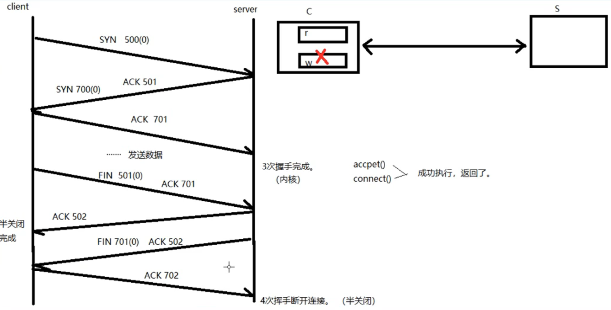


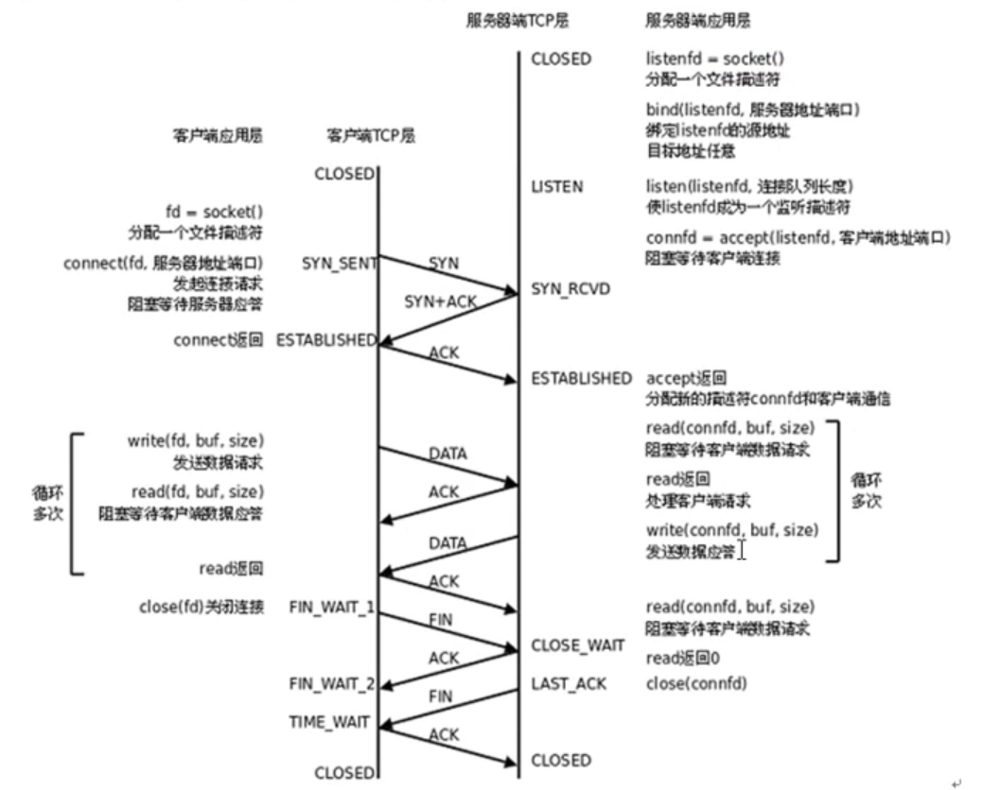


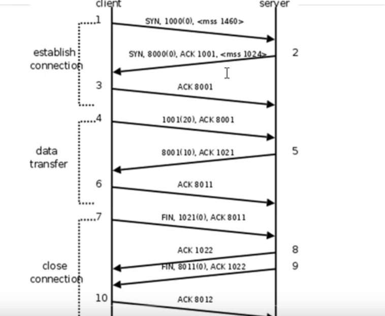


## TCP状态转换图（*）

### TCP状态时序图：

  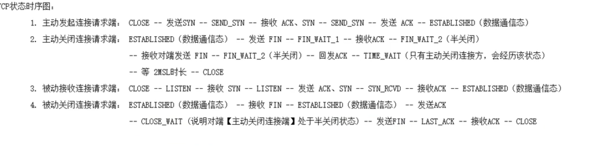


主动发起连接请求端：

`CLOSE`  -> 发送SYN -> `SYS_SEND` -> 接收ACK,SYN ->  `SYS_SEND` -> (发送ACK对端接收) -> `ESTABLISHED（数据通信状态）`


主动关闭连接请求端：

`ESTABLISHED`(数据通信状态) -> 发送FIN -> `FIN_EAIT_1` -> 接收ACK -> `FIN_WAIT_2` ->  接收FIN -> `FIN_WAIT_2（半关闭）`->回发ACK -> `TIME_WAIT` -> `2MSL时长` -> `CLOSE`


被动接收连接请求端：

`CLOSE` -> `LISTEN` -> 接收SYN -> `LISTEN` -> 发送 ACK、SYN -> `SYN_RCVD` -> 接收ACK -> `ESTABLISHED`


被动关闭连接请求端：

`ESTABLISHED` -> 接收FIN ->  `ESTABLISHED` -> 发送ACK -> `CLOSE_WAIT` -> 发送FIN -> `LAST_ACK` -> 接收ACK -> `CLOSE`


重点：`ESTABLISHED、FIN_WAIT2 --- CLOSE_WAIT、TIME_WAIT(2MSL)`


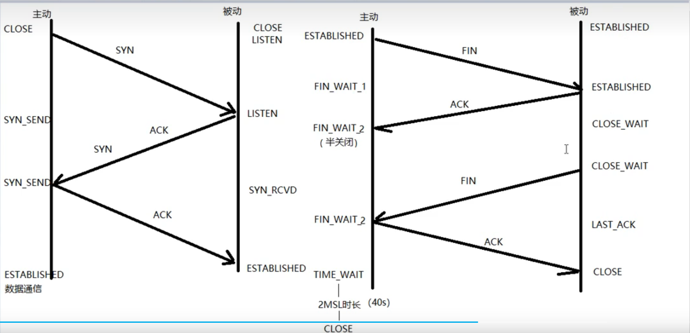


### 2MSL时长

 一定出现在 **主动关闭连接请求端** --- TIME_WAIT

保证：最后一个ACK能成功被 对端接收（等待期间，对端没收到主动端发送的ACK，对端会再次发送FIN请求）

 


查看状态`netstat -apn | grep 8000`


### 端口复用

`int opt = 1;` 

`setsockopt(lfd, SOL_SOCKET, SO_REUSEADR, (void *)&opt, sizeof(opt));`

在`socket`函数之后，`bind`函数之前 


### 半关闭

通信双方中，只有一端关闭通信。 --- FIN_WAIT_2

`close(cfd);`

`shutdown(int fd, int how);`

how: 

* SHUT_RD 关读端
* SHUT_WR 关写端
* SHUT_RDWR 关读写

shutdown在关闭多个文件描述符应用的文件时，采用全关闭的方法，close只关闭一个


# Socket编程


## 前置知识

### 网络套接字`socket`

在通信过程中，套接字一定是成对出现的 

一个socket有一个文件描述符 两个缓冲区，不同于管道，管道有两个文件描述符一个读端一个写端


### 网络字节序

  小端法：高位存高地址， 低位存低地址（计算机存储采用小端法）

大端法：高位存低地址，低位存高地址（TCP./IP协议规定，网络数据流应采用大端字节序）


本地字节序转网络：(小端法转大端法)

* htonl -> 本地-网络;ip
* htons -> 本地-网络;port

网络字节序转本地：(大端法转小端法)

* ntohl：网络-》本地；ip
* ntohs：网络 -》 本地; port

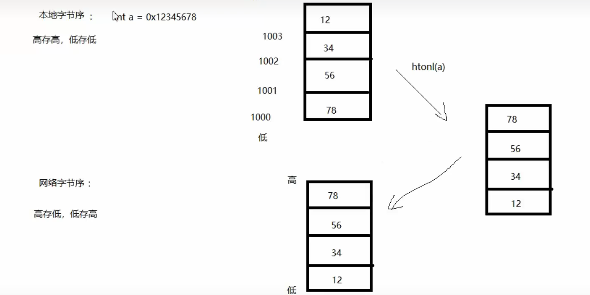


### IP地址转换函数 （字节序转换版本的封装）

`int inet_pton(int af, const char *src, void *dst);`  ip地址/本地字节序（string类型） ->   网络字节序(二进制)

* af：AF_INET, AF_INET6
* src：传入参数，点分十进制的ip地址
* dst：传出参数，转换为网络字节序的ip地址
* 返回值 ：成功返回1；异常返回0（src不是一个有效的ip地址）；失败返回-1`errno`

 

`const char *inet_ntop(int af, const void *src, char *dst, socklen_t size);`  网络字节序 -> 本地字节序(`string IP`)

* af：AF_INET, AF_INET6 
* src：网络字节序ip地址
* dst：本地字节序(string IP)
* size：dst的大小
* 返回值 ：成功返回dst；异常返回NULL


### sockaddr地址结构

 


 ```c
struct sockaddr_in addr;
addr.sin_family = AF_INET/AF_INET6;
add.sin_port = htons(9527);
add.sin_addr.s_arrd = htonl(INADDR_ANY);	// INADDR_ANY自动获取本机有效的ip地址（二进制形式）
 ```


## socket模型创建流程

#### 流程（*）


 一个客户端和 一个服务器进行通信一共有 三个套接字，一对用于通信，一个用于监听


**TCP通信流程分析(C/S模型)：**

server:

1. socket();
2. bind();    将创建的socket与服务端的地址结构 绑定
3. listen();    设置监听上限
4. accept();   阻塞监听客户端连接
5. read();  
6. toupper();
7. write(fd);
8. close();

client:

1. socket();
2. connect(); 与服务端建立连接
3. write()
4. read();
5. 显示读取结果
6. close();


#### 相关函数

`#include <sys/socket.h>`

`#include <arpa/inet.h>`

##### `socket `函数

`int socket(int domain, int type, int protocol);` 创建一个套接字文件（伪文件）

1. `domain`：AF_INET、AFINET6、AF_UNIX；选择网络类型

2. `type`：SOCK_STREAM 、 SOCK_DGRAM； 
   * 流式协议 (TCP，面向连接，可靠传输) ， 报式协议(UDP，不稳定 )

3. `protocol`：与`type`有关，一般传入0表示 选择典型协议，TCP、UDP

4. 返回值 ：
   * 成功：返回新套接字对应的文件描述符
   * 失败：-1、errno


##### `bind` 函数 

`int bind(int sockfd, const struct sockaddr *addr, socklen_t addrlen);` 

给socket绑定**自己的**地址结构(IP + port)；

1. `sockfd`：`socket`函数返回值
2. `addr`：传入参数，(struct sockaddr *)&addr;   addr结构体需要提前准备
   * struct sockaddr_in addr;
   * addr.sin_family = AFLINET;
   * addr.sin_port = htons(8888);
   * addr.sin_addr.s_addr = htonl(INADDR_ANY);
3. `addrlen`：sizeof(addr); 地址结构 的大小
4. 返回值 ：
   * 成功：0
   * 失败：-1，errno


##### `listen`函数 

上限128


##### `accept`函数

`int accept(int sockfd, struct sockaddr *addr, socklen_t *addrlen);`

阻塞等待客户端建立连接，成功的话，返回一个与客户端成功连接的sock et文件描述符

1. `sockfd`：`socket`函数返回值，`accept`函数依托于`socket`函数 

2. `addr`：传出参数，传出 与服务器建立连接的那个**客户端的**地址结构 (IP + port)
3. `addrlen`：传入传出参数，入：addr结构体的大小；出：客户端的addr实际大小
4. 返回值：
   * 成功：返回能与客户端进行数据通信的socket文件描述符
   * 失败：-1，errno


##### `connect`函数

客户端：`socket`+`connect`

`int connect(int sockfd, const struct  sockaddr *addr, socklent_t addrlen);`

使用现有的socket与服务器建立连接

1. `sockfd`：`socket`函数返回值
2. `addr`：传入参数，服务器的地址结构 
3. `addrlen`：服务器的地址结构大小
4. 返回值 ：
   * 成功：0
   * 失败：-1，errno

`connect`函数的第二个参数，需要提前设置结构体，例：

```c
struct sockaddr_in serv_addr;
serv_addr.sin_family = AF_INET;
serv_addr.sin_port = htons(9527);
// 结构体的ip地址（二进制），通过inet_pton函数的传出参数设定
inet_pton(AF_INET, "127.0.0.1", &serv_addr.sin_addr.s_addr));  
```
注意：客户端如果 不用`bind`函数绑定自己的地址结构，系统会采用  *隐式绑定*


'”土地的记忆就是人的记忆“


#### demo

服务端

```c
#include <stdio.h>
#include <stdlib.h>
#include <string.h>
#include <sys/socket.h>
#include <errno.h>
#include <netdb.h>
#include <ctype.h>
#include <fcntl.h>
#include <arpa/inet.h>
#include <unistd.h>

#define SERV_PORT 9527
#define BUF_SIZE 1024

void sys_err(int ret, char *str){
    perror(str);
    exit(1);
}

int main(int argc, char *argvp[]){

    int serv_fd = socket(AF_INET, SOCK_STREAM, 0);
    if(serv_fd == -1){
        sys_err(serv_fd, "socket error");
    }

    struct sockaddr_in serv_addr, client_addr;
    serv_addr.sin_family = AF_INET;
    serv_addr.sin_port = htons(SERV_PORT);
    serv_addr.sin_addr.s_addr = htonl(INADDR_ANY);
    int ret = bind(serv_fd, (struct sockaddr *)&serv_addr, sizeof(serv_addr));
    if(ret != 0){
        sys_err(ret, "bind_error");
    }

    ret = listen(serv_fd, 5);
    if(ret != 0){
        sys_err(ret, "lister error");
    }

    socklen_t client_addr_len = sizeof(client_addr); // 该参数是传入传出参数，需要有初始值
    int serv_cfd = accept(serv_fd, (struct sockaddr *)&client_addr, &client_addr_len);
    if(serv_cfd == -1){
        sys_err(ret, "accept error");
    }


    char buf[BUF_SIZE];
    
    while(1){

        ret = read(serv_cfd, buf, sizeof(buf)); // ret 是read读到的字节数

        write(STDOUT_FILENO, buf, ret);

        for(int i = 0; i<ret; ++i){
            buf[i] = toupper(buf[i]);
        }

        write(serv_cfd, buf, ret);
    }

    close(serv_fd);
    close(serv_cfd);

    return 0;
}
```

使用`nc 127.0.0.1 9527`进行测试

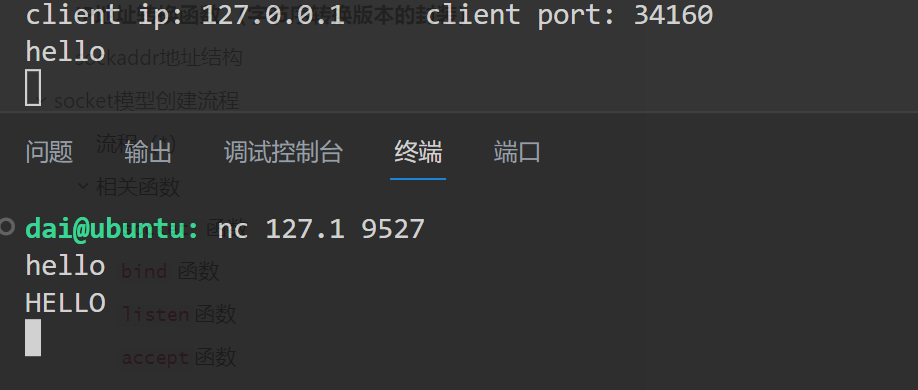

客户端

```c
#include <stdio.h>
#include <stdlib.h>
#include <string.h>
#include <sys/socket.h>
#include <errno.h>
#include <netdb.h>
#include <ctype.h>
#include <fcntl.h>
#include <arpa/inet.h>
#include <unistd.h>


void sys_error(char *str){
    perror(str);
    exit(1);
}

int main(int argc, char *argv[]){

    
    int client_fd = socket(AF_INET, SOCK_STREAM, 0);
    if(client_fd == -1){
        sys_error("socket error");
    }

    struct sockaddr_in serv_addr;
    serv_addr.sin_family = AF_INET;
    serv_addr.sin_port = htons(9527);
    inet_pton(AF_INET, "127.0.0.1", &serv_addr.sin_addr.s_addr);
    int ret = connect(client_fd, (struct sockaddr *)&serv_addr,  sizeof(serv_addr));
    if(ret  != 0){
        sys_error("connect error");
    }

    int count = 10;
    char buf[1024];
    while(count--){
        write(client_fd, "hello\n", 6);
        ret = read(client_fd, buf, sizeof(buf));
        write(STDOUT_FILENO, buf, ret);
        sleep(1);

    }

    close(client_fd);

    return 0;
}
```


## 封装常用函数 

### `Readn`函数

读取相应字节数

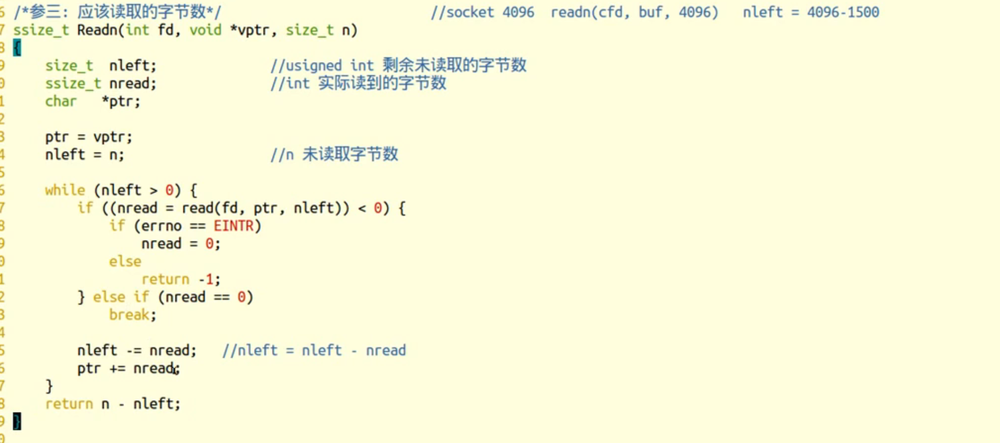


 

### `Writen`函数

写入相应字节数

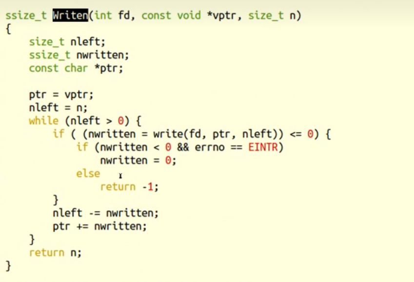


### `readline`函数 

`static`关键字限定c程序作用域 ，只作用于当前 模块

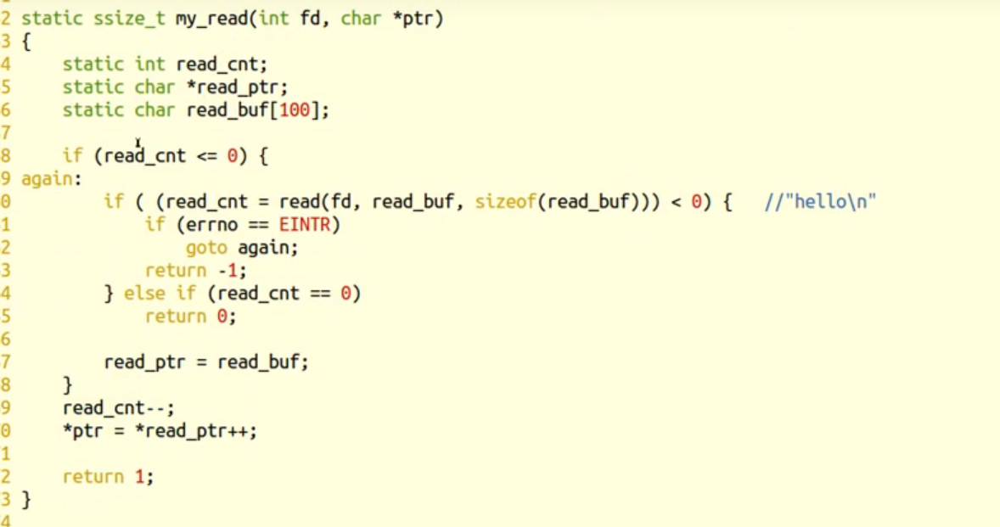


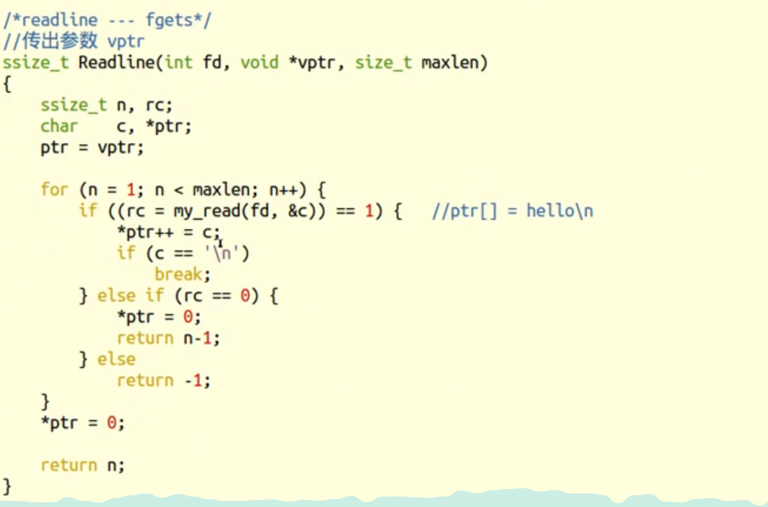


# 高并发服务器

将serve程序上传到指定服务器：`scp -r ./test/ 指定用户名@ip:/指定目录位置`


 

`read`函数 的返回值

* \>0 实际读到的字节数
* = 0 已经读到结尾（**对端已经关闭**）
* -1 进一步判断errno的值 
  * errno = EAGAIN or EWOULDBLOCK：设置了非阻塞方式读，没有数据到达 
  * errno = EINTR 慢速系统调用被中断
  * errno = "其他情况"异常


## `select`多路`IO`复用

### select多路IO转接

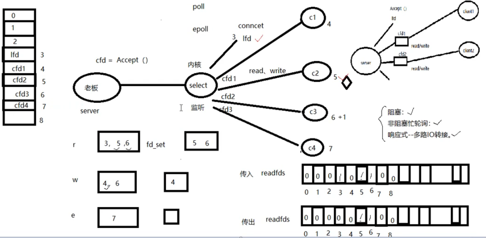

原理：借助内核 ，select来监听，客户端连接，数据通信事件


### 文件描述符 集合函数

`void FD_ZERO(fd_set *set);` 清空一个文件描述符集合

例：

```c
fd_set rset;
FD_ZERO(&rset);
```

`void FD_SET(int fd, fd_set *set);`，将待监听的文件描述符添加到监听集合中

`void FD_CLR(int fd, fd_set *set);`， 从监听集合中去除相应的文件描述符

`int FD_ISSET(int fd, fd_set *set);`，判断一个文件描述符是否在监听集合中

* 返回值 ：在1； 不在0


### `select`函数

`int select(int nfds, fd_set *readfds, fd_set *writefds, fd_set *exceptfds, struct timeval *timeout);`

参数：

* `nfds`：监听的文件描述符数量 = 监听的最大文件描述符 + 1
* `readfds`：读 文件描述符监听集合 --- 传入传出参数
* `writefds` ：传入传出参数
* `exceptfds`：传入传出参数
* `timeout`：
  * \> 0 ：设置监超时时长
  * NULL：阻塞监听
  * 0：非阻塞监听，轮询

返回值 ：

* \> 0 ：所有监听集合中，满足对应事件的总数
* 0：没有满足监听事件的文件描述符
* -1 ,errno


### 思路分析

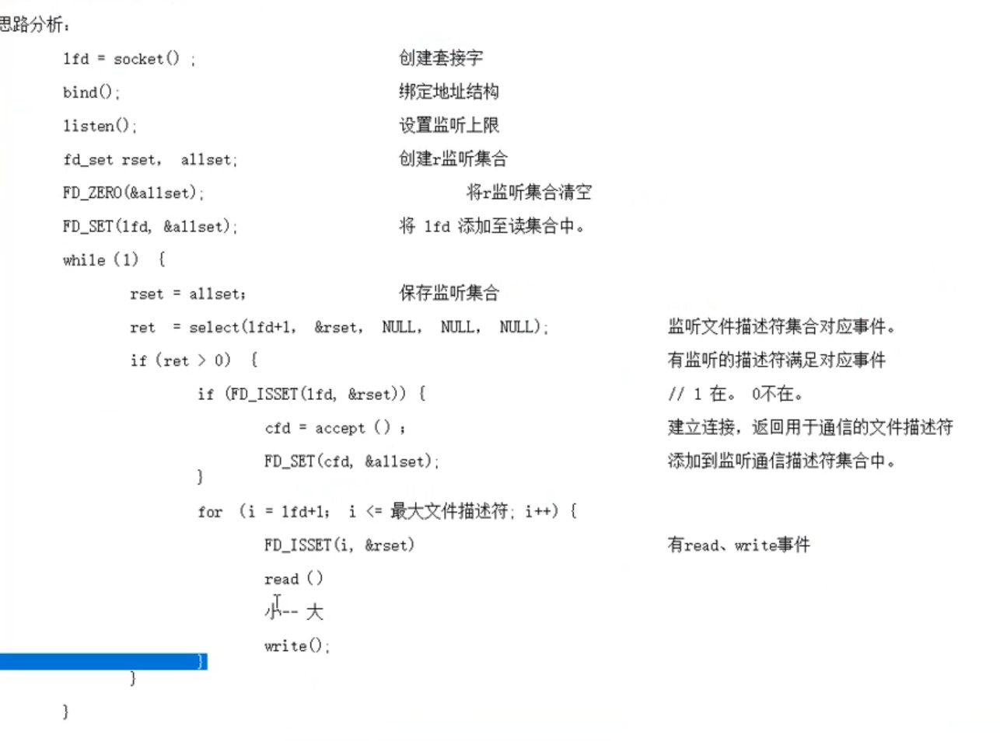


### select优缺点

缺点：

* 监听上限受文件描述符限制，最大1024
* 检测满足条件的id，需要自动添加业务逻辑，提高编码难度

优点：跨平台


自定义数组：

https://www.bilibili.com/video/BV1iJ411S7UA/?p=62&spm_id_from=pageDriver&vd_source=c4b85f17ebb9ce2f43461cac3ae9756e


## 多进程并发服务器

  [多线程多进程理论对比](https://www.bilibili.com/video/BV1iJ411S7UA/?p=37&spm_id_from=pageDriver&vd_source=c4b85f17ebb9ce2f43461cac3ae9756e)