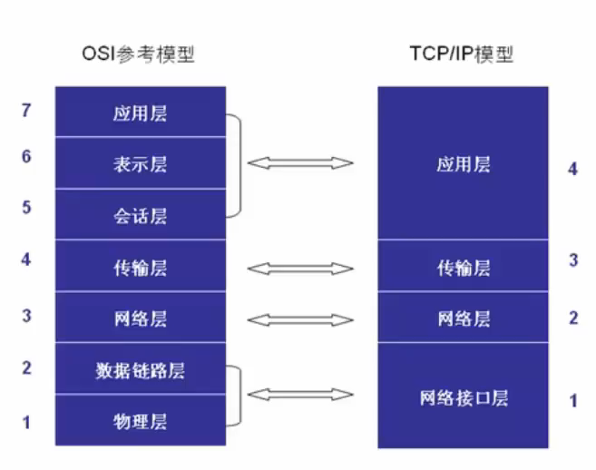
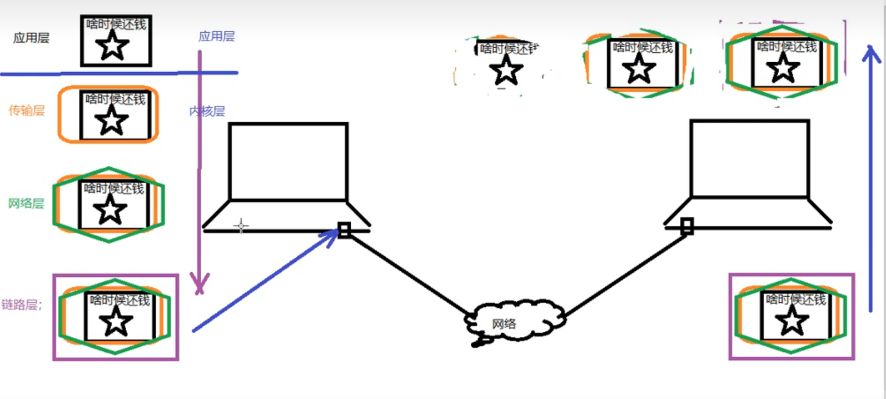
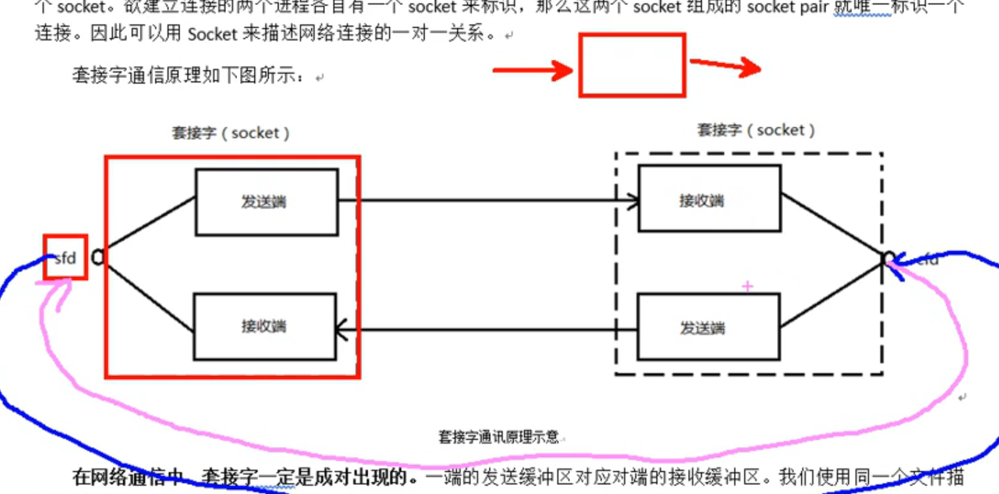
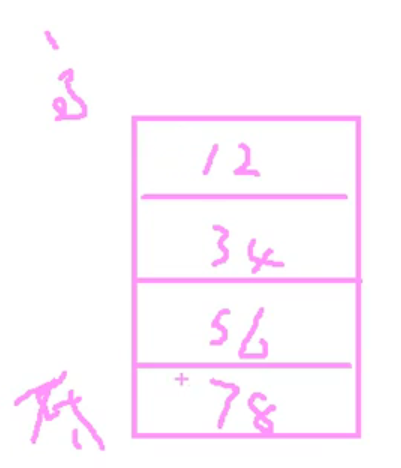
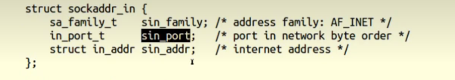
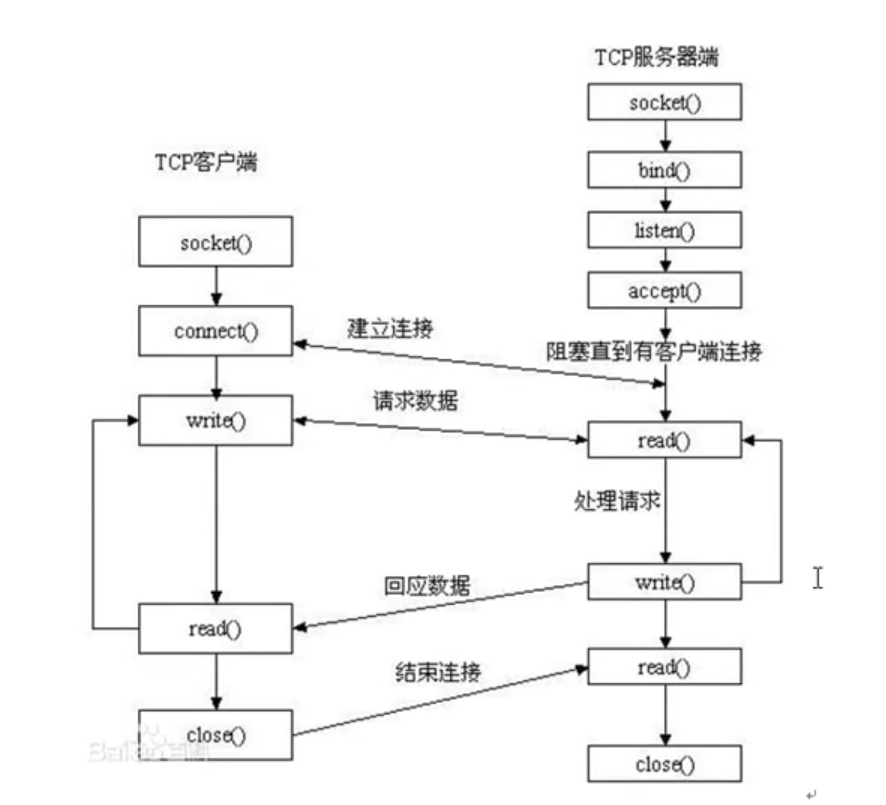
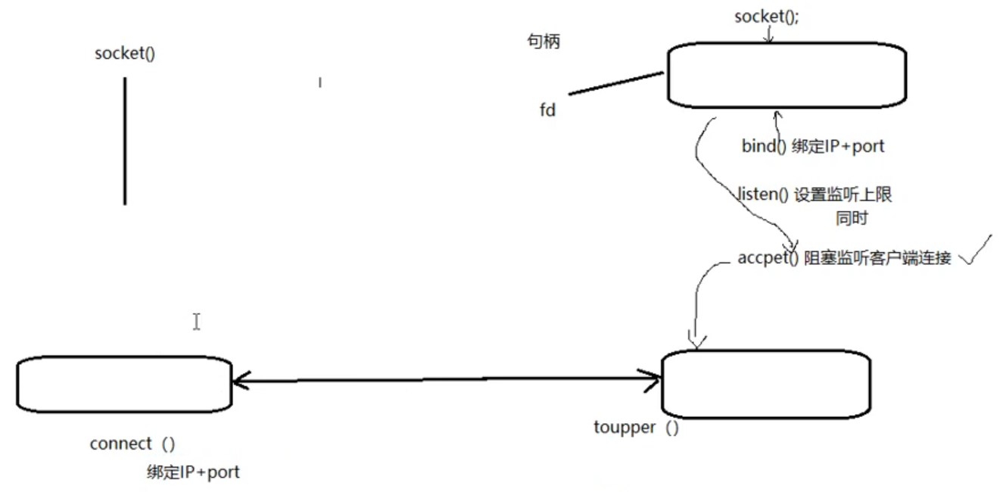

# 网络基础


##  协议

协议：一组规则 


## 分层模型

`OSI` 七层 模型结构 ：物、数、网、传、会、表、应

`TCP/IP` 4层模型：网(链路层/网络接口层)、网、传、应

* 应用层：`http, ftp, nfs, ssh, telnet..`
* 传输层：`TCP, UDP`
* 网络层：`IP, ICMP, IGMP`
* 链路层：`以太网帧协议，ARP`





网络传输流程：数据 没有封装之前 ，不能在网络中传递
数据  -> 应用层 -> 传输层 -> 网络层 -> 链路层


#### 以太网帧协议（链路层）

 ARP（0806）协议：根据IP地址获取 mac地址

以太网帧协议：根据mac地址完成数据包传输


#### IP协议

* 版本：IPv6, IPv4 --4位
* TTL：time to live ，设置数据包在路由节点中的跳转上限，每经过一个路由节点，该值 -1，减为0的路由有义务将该节点丢弃
* 源IP：32位---4字节	   192.168.1.108---点分十进制IP地址（string)，---二进制
* 目的IP：32位---4字节


#### UDP协议

* 16位：源端口号，  2^16 = 65536
* 16位：目的端口号


#### TCP协议

* 16位：源端口号，  2^16 = 65536
* 16位：目的端口号
* 32位序号
* 32位确认序号
* 6个标志位
* 16位窗口大小


### serve模型

C/S 模型 ：client-server

* 优点：缓存大量数据，协议选择灵活（一定程度上可以自定义）
* 缺点：安全性低，开发工作量较大

B/S模型：browser-serve

* 优点：安全性，跨平台，开发工作量小
* 缺点：不能缓存大量数据，严格遵守http


### 注意：

IP地址：可以在网络环境中，唯一标识 一台主机

端口号：可以在连接网络的一台主机中，唯一标识主机上的进程

IP地址+端口号：可以在网络环境中，唯一标识一个进程


## 通信过程



应用层需要自行编程实现，此外三层是内核 层由系统 实现


---

# Socket编程


## 前置知识

### 网络套接字`socket`

在通信过程中，套接字一定是成对出现的 

一个socket有一个文件描述符 两个缓冲区，不同于管道，管道有两个文件描述符一个读端一个写端




### 网络字节序

  小端法：高位存高地址， 低位存低地址（计算机存储采用小端法）， 如int a = 0x12345678;

大端法：高位存低地址，低位存高地址（TCP./IP协议规定，网络数据流应采用大端字节序）


本地字节序转网络：(小端法转大端法)

* htonl -> 本地-网络;ip
* htons -> 本地-网络;port

网络字节序转本地：(大端法转小端法)

* ntohl：网络-》本地；ip
* ntohs：网络 -》 本地; port


### IP地址转换函数 （字节序转换版本的封装）

`int inet_pton(int af, const char *src, void *dst);`  ip地址/本地字节序（string类型） ->   网络字节序(二进制)

* af：AF_INET, AF_INET6
* src：传入参数，点分十进制的ip地址
* dst：传出参数，转换为网络字节序的ip地址
* 返回值 ：成功返回1；异常返回0（src不是一个有效的ip地址）；失败返回-1`errno`

 

`const char *inet_ntop(int af, const void *src, char *dst, socklen_t size);`  网络字节序 -> 本地字节序(`string IP`)

* af：AF_INET, AF_INET6 
* src：网络字节序ip地址
* dst：本地字节序(string IP)
* size：dst的大小
* 返回值 ：成功返回dst；异常返回NULL


### sockaddr地址结构

 


 ```c
struct sockaddr_in addr;
addr.sin_family = AF_INET/AF_INET6;
add.sin_port = htons(9527);
add.sin_addr.s_arrd = htonl(INADDR_ANY);	// INADDR_ANY自动获取本机有效的ip地址（二进制形式）
 ```


## socket模型创建流程

#### 流程图




 一个客户端和 一个服务器进行通信一共有 三个套接字，一对用于通信，一个用于监听




#### 相关函数

##### `socket函数 `

`int socket(int domain, int type, int protocol);` 创建一个套接字

1. `domain`：AF_INET、AFINET6、AF_UNIX；选择网络类型

2. `type`：SOCK_STREAM 、 SOCK_DGRAM； 
   * 流式协议 (TCP，面向连接，可靠传输) ， 报式协议(UDP，不稳定 )

3. `protocol`：与`type`有关，一般传入0表示 选择典型协议，TCP、UDP

4. 返回值 ：
   * 成功：返回新套接字对应的文件描述符
   * 失败：-1、errno


##### `bind`函数 

`int bind(int sockfd, const struct sockaddr *addr, socklen_t addrlen);` 给socket绑定一个地址结构(IP + port)；

1. `sockfd`：`socket`函数返回值
2. addr：(struct sockaddr *)&addr;   addr结构体需要提前准备
   * struct sockaddr_in addr;
   * addr.sin_family = AFLINET;
   * addr.sin_port = htons(8888);
   * addr.sin_addr.s_addr = htonl(INADDR_ANY);
3. addrlen：sizeof(addr); 地址结构 的大小


---

# 高并发服务器