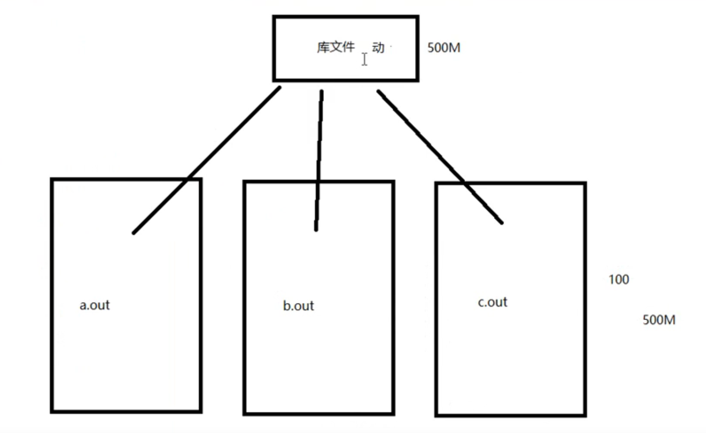
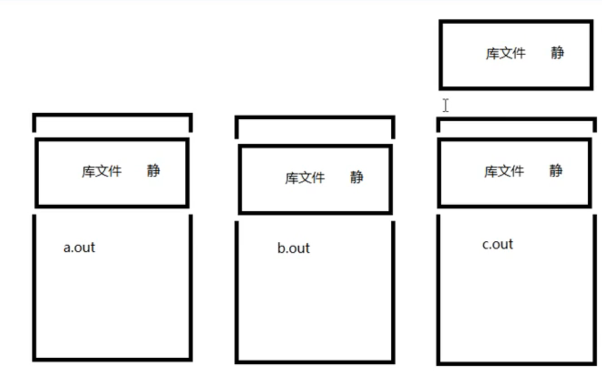
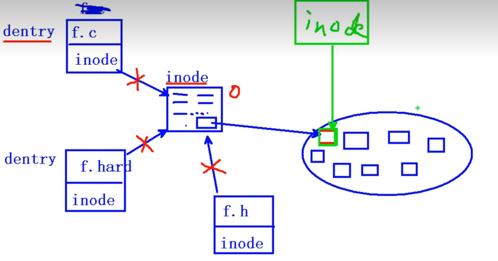
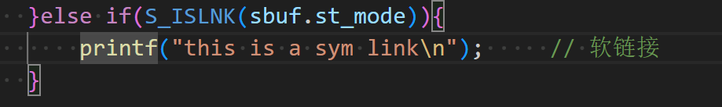
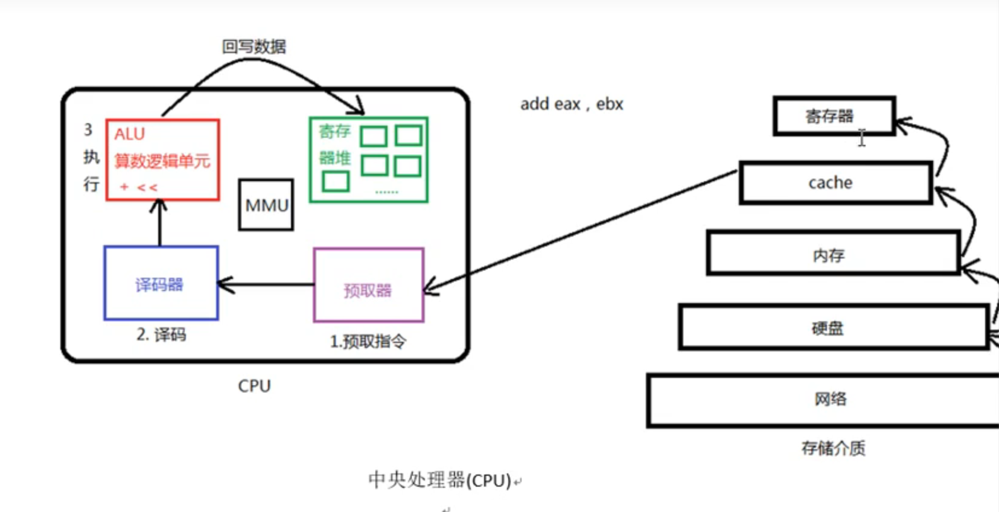
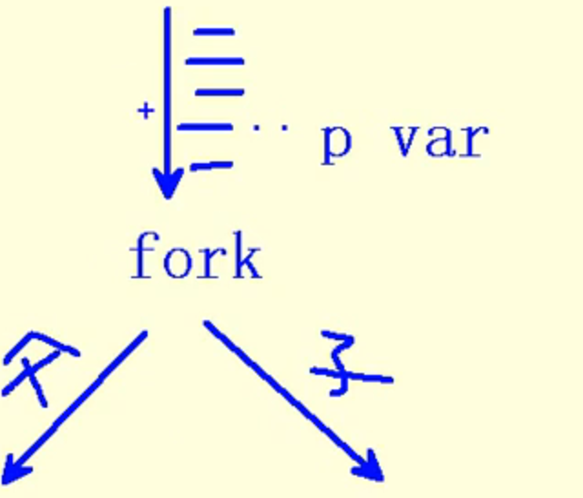
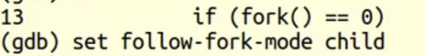

# 杂项

## 修改前缀

修改~/.bashrc文件中的PS1即可。
	如：` PS1='\[\033[1;32m\]\u@\h:\w\$\[\033[0m\] ' `

**`ip`地址**：`47.113.150.236`


# linux命令操作


## 基本命令和Shell脚本编程

```bash
ls 		# 列出当前目录所有文件和目录
ls -l 	# 更加详细 == ll
ls -a 	# 展示隐藏文件
ls -d  	# 显示目录
ls -la 

cd 			# 进入目录
cd .. 		# 进入上一层目录
cd ../.. 	# 进入上二层目录
cd - 		# 返回刚才的目录

pwd 	# 打印当前路径

date	# 显示 日期与时间
cal		# 显示日历
bc		# 计算器 ，默认输出整数
	scale=3		# 调整输出精度
	quit		# 退出 bc

cat		# 查看文件内容
head 	# 想看文件开头内容
head --lines=2 README.md # 查看文件开头二行
tail	# 查看尾部内容 ,也有--lines的用法
less	# 查看全文
more	# 和less差不多，在linux中只有向下翻页 
file 	# 查看文件格式等信息
where gcc #查看gcc的位置

echo	# 打印


# shell的for循环
# 如当前目录有week01~week05等文件，批量将week修改为chapter，序号不变
for ff in week??
> do 
> mv $ff chapter${ff#week} # '#'去头操作，'%'去尾操作
> done
# 没有撤销操作要小心，可以先echo打印看看，再操作
```


 


## 快捷键/热键

```bash
1. [tab] # 命令补全，文件补全
	ca[tab][tab] # 显示所有ca开关的命令
	
2. [ctrl]+c # 终止当前指令
3. [ctrl]+d # 键盘输入结束 ，= exit

4. [ctrl]+a # 在命令行中光标至开头
5. [ctrl]+e # 在命令行中光标至结尾
5. [ctrl]+u # 清空当前命令行

6. [shift]+[pageup],[shift]+[pageup] # 翻页

	
```


## 帮助说明 `man` `help`,`info`

1. 知道某个指令，忘记了相关选项与参数，使用`--help`查询 
2. 有任何不知道的指令或文件格式，使用`man`和`info`来查询 
3. 关于一些服务的说明文档，在`/usr/share/doc`

```bash
command --help # 查看命令的帮助文档
man date 	# 更详细的内容说明	 
进入man page 页面后的操作：
	[空格] # 下翻 
	[page up],[page down] # 翻页
	[home]	# 去到第一页
	[end]	# 去到最后一页
	/string # 向下搜索string 
	?string # 向上搜索string  // 利用?或/搜索字符串时，用n,N向下向上搜索
	q	# 离开
	

```

| man page页面的数字标号说明 |                                                              |
| -------------------------- | ------------------------------------------------------------ |
| 数字 标号                  | 代表内容                                                     |
| **1**                      | **用户在`shell`环境下可以操作的指令或执行文件**              |
| 2                          | 系统核心可呼叫的函数与工具等                                 |
| 3                          | 一些常用的函数或函数 库，大部分为c的函数库                   |
| 4                          | 装置文件的说明，通常在/dec下的文件                           |
| **5**                      | **配置文件或者 是某些文件的格式**                            |
| 6                          | 游戏(games)                                                  |
| 7                          | 惯例与协议等，例如linux文件系统，网络协议，`ASCII code`等等的说明 |
| **8**                      | **系统管理员可用的管理的指令**                               |
| 9                          | 和`kernel`有关的文件                                         |


| man page页面的内容说明 |                                                |
| ---------------------- | ---------------------------------------------- |
| NAME                   | 简短的指令数据 名称说明                        |
| SYNOPSIS               | 语法说明                                       |
| DESCRIPTION            | 较为完整的说明                                 |
| OPTIONS                | 针对 SYNOPSIS部分可选参数的说明                |
| COMMANDS               | 程序执行时可执行的选项                         |
| FILES                  | 这个程序或数据所使用或参考或连接到的某些文件   |
| SEE ALSO               | 可以参考的，跟这个 指令或数据 有相关的其他说明 |
| EXAMPLE                |                                                |
|                        |                                                |


关于`info page`

| 按键        | 进行工作                                    |
| ----------- | ------------------------------------------- |
| 空格键      | 下翻一页                                    |
| [page down] | 下翻一页                                    |
| [page up]   | 上翻一页                                    |
| [tab]       | 在node之间移动，有node的地方，通常会以*显示 |
| [enter]     | 当光标在node上面时，按下enter可以进入该node |
| b           | 光标移动到该info画面当中的第一个node处      |
| e           | 移动光标到该info画面当中的最后一个node片    |
| n           | 前往下一个node处                            |
| p           | 前往上一个node处                            |
| u           | 向上移动一层                                |
| s(/)        | 在info page 当中进行搜寻                    |
| h,?         | 显示 求助选单                               |
| q           | 结束 这次的info page                        |


## SSH

**安装ssh服务端**

```bash
sudo apt updata
sudo apt install openssh-server -y
sudo systemctl status ssh # 查看状态
sudo ufw allow ssh # 应对防火墙
```


**连接**

```bash
ssh username@ip  # 基本ssh 连接方法

# 给ip地址取别名，10.22.75.177是ip地址
sudo vim /etc/hosts -> 10.22.75.177 name 

ssh username@ipname
```

进一步的简化

```bash
vim ~/.ssh/config
	Host l1
	HostName linx
	Port 22
	User dai
	
# 连接
ssh l1
```


## 关于`linux`正确的关机方法

1. 观察系统的使用状态

   ```bash
   who # 查看在线使用人员
   netstat -a # 查看网络的联机状态
   ps -aux # 查看背景执行的程序 
   ```

2. 通知在线使用者关机的时刻

   ```bash
   # 使用shutdown的特别指令，给在线的使用者一些时间结束他们的工作
   ```

3. 正确的关机指令使用

   ```bash
   shutdown , reboot
   ```

其他相关指令：

1. `sync`：

   ```bash
   sync # 数据同步写入磁盘
   ```

   


# vim

## 基本操作/vi

### **移动光标**：

1. h(左移) 	j(下移)	k(上移)	l(右移)
2. 多次移动: `30j`向下移动30次
3. 屏幕向下/向上移动一页 `[ctrl]+[f]  /  [ctrl] + [b]`半页是`u/d`
4. 移动到行首/行尾：`0,$`
5. 移动到第一行,最后一行`gg,G`
6. 移动到n行：`nG`
7. 向下移动n行：`n[enter]`

### **搜索与代替**

1. 向光标之下寻找一个名为`word`的字符串：`/word`
2. 向光标之上寻找一个名为`word`的字符串：`?word`
3. 继续向下搜索：`n`，继续 向上搜索：`N`
4. 在某个范围内找到字符串并替换：`:n1,n2s/word1/word2/g`
   例 ：从第一列到最后一列寻找word1字符串，并将该字符串取代为word2，在取代前提示
   `:1,$s/word1/word2/gc` 
5. 替换通篇：`:%s/word1/word2/g`

### **删除，复制，粘贴 **

1.  向前删除：`X(当前光标覆盖的不会删除)`,向后删除：`x(删除当前光标所覆盖)`,多删`nx/nX`

2. 删除光标所在行：`dd`

3. 删除从光标开始的n行：`nd`

4. 删除光标所在行到第n行的数据 ：`dnG`

5. 删除光标所在行到最后一行的数据 ：`dG`

6. 删除光标处到行首的字符 ：`d0`

7. 删除光标和到行尾的字符 ：`d$`

   ---

8. 复制光标所在行：`yy`

9. 复制光标向下的n行：`nyy`

10. 复制光标所在行到第n行的所有数据 :	`ynG`

11. 复制光标所在行到最后一行的数据 ：`yG`

12. 复制光标所在处到行首：`y0`

13. 复制光标所在处到行尾：`y$`

    

    ---

14. 粘贴到上一行：`P`,粘贴 到下一行：`p`

15. 将光标所在行与下一行合并：`J`，有空格分隔

16. 撤销操作：`u`,反撤销：`[ctrl]+r`（关于ctrl + r 其实我不太懂）

17. 重复操作：`.`

    

### **进入插入或取代的编辑模式**

1. 进入插入模式：`i(从目前光标处插入)，I(在目前所在行的第一个非空格符处开始插入，也就是在开头插入)`

2. 进入插入模式：`a(从光标所在的下一个字符处开始插入)，A(从光标所在行的最后一个字符处开始插入)`

3. 进入插入模式：`o(从下一行开始插入)，O(从上行开始插入)`

4. 进入取代模式：`r(只会取代光标所在的字符一次),R(一起取代光标所在的字符，直到[ESC])`

   

### **指令行命令**

1. 将编辑的数据另存新档：`:w [filename]`
2. 读入另一个文件的数据，加到当前行的后面：`:r [filename]`
3. 将n1到n2的数据 存储到`filename`文件：`:n1,n2 w [filename]`
4. 执行`shell`命令`:!command`
5. 显示 行号，取消行号：`set nu / set nonu`

## 多文件编辑

1. 编辑下一个文件：`:n`，编辑上一个文件：`:N`

2. 列出vim开启的所有文件：`:files`

   

   

## 多窗口编辑

1. 开户一个新的窗口：`sp(垂直方向)，vs（水平方向）`
2. 切换窗口：`[ctrl]+w+j/k 向下切换窗口/向上切换窗口`


## vim的补全功能

1. 根据当前文件的数据为基础作补全：`[ctrl]+x -> [ctrl]+n`

2. 以扩展名作业语法补充，以vim内建的关键词予以补全：`[ctrl]+x -> [ctrl]+o`

   

## vim环境设定与记录：`~/.vimrc`, `~/.viminfo`

1. 设定/取消行号：`set nu / set nonu`
2. 高亮度搜索：`set hlsearch / set nohlsearch`
3. 自动缩排：`set autoindent / set noautoindent`
4. 语法检验：`syntax on/off`
5. 设置颜色色调：`set bg=dark/light`


关于`.vimrc`

```bash
autocmd # 自定义函数脚本


```


# git相关：
### 为git添加key
1. 设置git的username和useremail
```Git
$ git config --global user.name "dai_linux"
$ git consig --global user.email "dai_linux.email"
```
2. 生成密钥

    `ssh-keygen -t rsa -C "dai_linux.email"`
3. 复制公钥在github中添加即可


# 系统编程

## gcc编译4步骤


编译阶段逐行检查代码，最耗时

**链接**：

地址回填


 数据段合并（节省空间）


**`gcc`常用参数：**

1. `-I ` 指定头文件，适用于当源码和头文件不在同一目录下，处于同一目录下时，可省略`-I`
2. `-c`：只做预处理，编译，汇编，得到二进制文件
3. `-g`：编译时添加调试文件
4. `-Wall`：显示 所有警告信息
5. `-D`：在程序 中注册一个宏  如`gcc -c hello.c -o hello -D HELLO`,可以用来作调试信息的开关


## 动态库和静态库

**静态库和动态库（共享库）的区别**：动态库动态调用速度理论上慢一些，现在已经很很快了

​	静态库：适用于对空间要求低，对时间要求高的核心程序 中，如操作系统 的启动进程

​	动态库：适用于对时间要求低，对空间要求高





### 静态库的制作和使用

**制作：**

`ar rcs libmylib.a file1.o` 

* 静态库库名要求以`lib`开头，`.a`结尾，`mylib`可以修改

```bash
1. 生成.o文件
gcc -c add.c -o add.o
...

2. 使用ar工具制作静态库
ar rcs libmymath.a add.o sub.o div1.o 
```

**使用：**

```bash
# 和源码一起编译
gcc  test.c lib库名.a -o a.out
```

会警告隐式声明，需要做静态库的头文件对应,在源码中包含头文件`#include "mymath.h"`

```c
// mymath.h
#ifndef _MYMATH_H_
#define _MYMATH_H_
int add(int, int);
int sub(int, int);
int div1(int, int);
#endif
```


### **动态库的制作和使用**：

**制作**：

1. 生成.o文件,生成与位置无关的代码，`-fPIC`

   ```bash
   gcc -c add.c -o add.o -fPIC
   ```

2. 使用`gcc -shared`制作动态库

   ```bash
   gcc -shared -o lib库名.so add.o ...
   ```

   

**使用**：

编译可执行程序 时，指定所使用的动态库， `-l(指定库名) -L(指定库路径)`

```bash
gcc test.c -o a.out -lmymath -L./lib  -I ./include
```

报错：找不到动态库,原因：

​	链接器：工作于链接阶段， 工作时需要 `-l -L` 

​	动态链接器：工作于程序 运行阶段，工作时需要提供动态库所在目录位置，通过环境变量:

​							` export LD_LIBRARY_PATH=./lib`解决问题，但随着退出终端进程消失，设置失效，进一步的修改bashrc							文件（终端配置文件）

```bash
vi ~/.bashrc
	export LD_LIBRARY_PATH=./lib 
source .bashrc
```


## `gdb(gcc debug)`工具

基础指令

```bash	

gdb a.out # 打开调试信息

list 1 # 从第一行开始查看源码 ， l 继续显示 

b/break 52 # 设置断点在52行，delete删除断点

run/r # 运行程序 到断点所在行（断点处尚未执行）

n/next  s/setp # 如果是函数 ，s会进入函数体内，n 不会

 p/print i # 使用p查看变量i的值 
 
 continue # 执行到下一个断点
 
 quit # 退出
```

其他指令

```bash
run # 直接使用run查找 错误出现位置

start # 直接使用start ，开始单步执行，n/s执行下一步,s进入函数时，可用finish 退出 ，start显示出来内容是还没有执行的语句 

finish # 结束 当前 函数调用，返回到函数调用点

 # 如果 main函数 是带有参数的,如：int main(arg[]);,可在gdb中直接使用set或run设置
 set args 	aa bb cc dd
 start
 或
 list 1 
 b 41
 run 		aa bb cc dd
 
 # 查看断点信息表：
 info b
 
 # 设置条件断点,用于循环/递归/嵌套中
 b 20 if i = 5
 
 # 查看变量类型
 ptype i 
 
 # 列出当前 程序 正存活着的栈帧
 backtrace/bt 
 # 根据编号切换 栈帧
 frame/f
 
 # 设置追踪变量
 display 变量名
 undisplay 编号 # 取消追踪
 
```


## 文件io


### 系统 函数 /系统调用

####   `open/close`

```c
// flags: O_RDONLY, O_WRONLY, O_RDWR, O_APPEND, O_CREAT, O_EXCL(是否存在), O_TURNC, O_NONBLOCK(非阻塞)
// mode_t mode 指定文件权限，在创建文件时会用到
int open(const char *pathname, int flags);
int open(const char *pathname, int flags, mode_t mode);

```

例：

```c
#include <unistd.h>
#include <fcntl.h> // 服务于O_RDONLY
#include <stdio.h> 
#include <errno.h>
#include <string.h> // 服务于strerror

int main(){
	int fd;
	fd = open("./dai.text", O_RDONLY); // 打开已有文件不需要第三个参数来指定文件权限
	
	// 如果 文件存在，以只读方式打开并截断成0，如果不存在，创建并指定文件权限为0644,1x,2w,4r
	// 创建文件时访问权限 = mode & ~umask(775) 
	int fd2 = open("./GG_.text", O_RDONLY | O_CREAT | O_TRUNC, 0644); // rw-r--r--

	int fd3 = open("./GGGG.txt", O_RDONLY);

	printf("fd = %d\n", fd);
	printf("fd2 = %d\n", fd2);
	printf("fd3 = %d, erron = %d:%s\n", fd3, errno, strerror(errno));

	close(fd);   
	close(fd2);
	return 0;
}

```


#### `read`函数 

`ssize_t read(int fd, void *buf, size_t count);`
	`fd`:文件描述符
	`buf`：存数据的缓冲区（临时存放数据 的区域）
	`count`：缓冲区的大小
	返回值 ：成功（返回读到的字节数，0表示读完）；失败（-1，设置errno） 

#### `write`函数

` ssize_t write(int fd, const void* buf, size_t count);`
	`fd`：文件描述符
	`buf`：待写出数据 的缓冲区
	`count`：数据 大小
	返回值 ：成功（写入的字节数），失败（-1，设置errno）【如果 返回-1且error=EAGIN或EWOULDBLOCK，说明不是					read失败，而是read在以非阻塞方式读一个设备文件或网络文件，并且文件无数据 】

#### **文件描述符**：

PCB进程控制块，本质 是一个结构体，体内有一个指针指向文件描述表


 其中0~2号分别是：`STDIN_FILENO,STDOUT_FILENO,STDERR_FILENO`,默认打开表中编号 最小的

文件


#### 作业：实现cp拷贝文件

实现1：系统函数 `read`,`write`

```c
#include <stdio.h>
#include <stdlib.h>
#include <string.h>
#include <unistd.h>
#include <pthread.h>
#include <fcntl.h>


int main(int argc, char *argv[]){

    int fd1 = open(argv[1], O_RDONLY);
    if(fd1 == -1){
        perror("open argv1 error");  // 等同于printf + strerror()
        exit(1);
    }
    int fd2 = open(argv[2], O_RDWR | O_CREAT | O_TRUNC, 0644);
    if(fd2 == -1){
        perror("open argv2 error"); 
        exit(1);
    }

    char buf[1024]; // 设置缓冲区大小
    int n = 0; // read函数 的返回值 ，即读取到的字节数
    while((n=read(fd1, buf, 1024)) != 0){
        if(n < 0){
            perror("read error");
            break;
        }

        write(fd2,buf,n);
    }

    close(fd1);
    close(fd1);

    return 0;
}
```

实现二：`fgetc`,`fputc`(c库函数的版本)

```c
#include <stdlib.h>
#include <stdio.h>

int main(void){

    FILE *fp, *fp_out;
    fp = fopen("dict.txt", "r");
    if(fp == NULL){
        perror("fopen1 error");
        exit(1);
    }

    fp_out = fopen("dict.cp", "w");
    if(fp_out == NULL){
        perror("fopen2 error");
        exit(1);
    }

    int n;
    while((n=fgetc(fp))!= EOF){
        fputc(n,fp_out);
    }
    fclose(fp);
    fclose(fp_out);

    return 0;
}
```


**问题**：c函数 版本更快，比系统 调用更快，因为`fputc`每次4096
	从用户空间到内核空间非常耗时，`fputc`有一个默认的缓冲区，存够4096个字节再到内核，而系统调用没有这个机制，会根据用户设定的字节大小访问内核，该大小如果 较小 ，就会多次访问内核耗时


<center >预读入缓输出</>


#### 阻塞与非阻塞

产生阻塞的场景：读设备文件，网络文件，常规文件无阻塞

阻塞是设备文件和网络文件的属性，不是函数的属性

设备文件如：`/dev/tty -- 终端文件`

```c
#include <stdlib.h>
#include <stdio.h>
#include <errno.h>
#include <unistd.h>
#include <string.h>
#include <fcntl.h>

int main()
{

    int fd, n;
    char buf[10];

    fd = open("/dev/tty", O_RDONLY | O_NONBLOCK);
    if(fd<0){
        perror("open /dev/tty");
        exit(1);
    }

    tryagain:

        n = read(fd, buf, 10);
        if (n < 0)
        {
            if (errno != EAGAIN)
            {
                perror("read /dev/tty");
                exit(1);
            }else{
                
                write(STDOUT_FILENO, "try again\n", strlen("try again\n"));
                sleep(2);
                goto tryagain;

            }
        }

        write(STDOUT_FILENO, buf, n);
        close(fd);


    return 0;
}
```


#### `fcntl`函数 

`int flags = fcntl(fd, F_GETFL);`
	`F_GETFL`：获取 文件状态
	`F_SETFL`：设置文件状态


将文件设置为非阻塞状态

`flags |= O_NONBLOCK;`
`fcntl(fd, F_SETFL, flags);`


#### `lseek`函数 

`off_t lseek(int fd, off_t offset, int whence);`

参数：

1.  `fd`：文件描述符
2. `offset`：偏移量
3. `whence`：起始偏移量：，`SEEK_SET/SEEK_CUP/SEEK_END`

返回值 ：

1. 成功：返回偏移量
2. 失败：-1，`errno`

应用场景：

1. 文件的读写使用同一偏移位置
2. 使用lseek获取`int length = lseek(fd, 0, SEET_END);`
3. 拓展文件大小`int addsize = lseek(fd, 111, SEET_END);`,
   注意：要想使文件大小真正拓展，必须引起`Io`操作,如下图，`lseek`增加110，写入`a`再加1，总共扩展容量为111
4. 关于扩展文件大小一个常用函数 ：`int ret = truncate("/daict.cp", 250);`，成功返回0失败返回-1


文件的读写使用同一偏移量：

```c
#include <stdlib.h>
#include <stdio.h>
#include <unistd.h>
#include <fcntl.h>
#include <string.h>

int main(){

    int fd,n;
    char msg[] = "this is a test for lseek\n";
    char ch;

    fd = open("lseek.txt", O_RDWR | O_CREAT, 0644);
    if(fd<0){
        perror("open lseek.txt error");
        exit(1);
    }

    write(fd, msg, strlen(msg));

    lseek(fd, 0, SEEK_SET); // 文件读写位置在同一位置，需要重置偏移量

    while((n=read(fd, &ch, 1))){  // read函数的第二个参数是指向缓冲区的指针，所以这里需要取地址
        if(n<0){
            perror("read error");
            exit(1);
        }
        write(STDOUT_FILENO, &ch, n);
    }

    close(fd);


    return 0;
}
```


#### 传入参数/传出参数

传入参数：

1. 指针作为函数参数
2. 通常有`const`关键字修饰
3. 指针指向有效区域，在函数内部作读操作

传出参数：

1. 指针作为函数参数
2. 在函数 调用之前 ，指针指向的空间可以无意义，但必须有效
3. 在函数 内部作写操作
4. 在函数 调用结束后，充当函数返回值 

传入传出参数：

1. 指针作为函数参数
2. 在函数调用之前 ，指针指向的空间有实际意义
3. 在函数 内部，先做读操作，后做写操作
4. 函数调用结束 后，充当函数返回值 


### 文件系统 

#### 文件存储



一个文件有文件目录项`dentry`和`inode`两部分组成，inode节点引用计数为0不会删除其指向的磁盘空间内容，磁盘内容只会被 覆盖不会被 删除

#### `stat`函数 

`int stat(const char *path, struct stat *buf);`

参数：

1. `path`
2. `buf`：（传出参数） 存放文件属性

返回值 ：

1. 成功：0

2. 失败：-1 errno

   

获取文件大小：`buf.st_size`
获取文件类型：`buf.st_mode`
获取文件权限：`buf.st_mode`


```c
#include <stdlib.h>
#include <stdio.h>
#include <unistd.h>
#include <fcntl.h>
#include <string.h>
#include <sys/stat.h>

int main(int argc, char *argv[]){

    struct stat sbuf;

    int ret = stat(argv[1], &sbuf); // int ret = lstat(argv[1], &sbuf);
    if(ret < 0){
        perror("stat error");
        exit(1);
    }
    // 获取文件大小
    printf("file size:%ld\n", sbuf.st_size); // st_size是long int 型
    // 利用宏函数 判断文件类型
    if(S_ISREG(sbuf.st_mode)){
        printf("this is a regular\n");      // 普通 文件
    }else if(S_ISDIR(sbuf.st_mode)){
        printf("this is a dir");            // 目录````
    }else if(S_ISFIFO(sbuf.st_mode)){
        printf("this is a pipe\n");         // 管道
    }else if(S_ISLNK(sbuf.st_mode)){
        printf("this is a sym link\n");     // 软链接
    }
    return 0;
}
```

#### `lstat`函数 

`stat`会穿透符号链接，`lstat`不会

如对于一个软链接

`int ret = stat(argv[1], &sbuf);`打印结果是常规文件

`int ret = lstat(argv[1], &sbuf);`打印结果是软链接


关于文件权限说明：`st_mode`


#### `access`函数 


#### `chmod`函数 


#### `link`函数 

创建一个文件的目录项

`unlink`函数 ：删除一个文件的目录项

利用`link+unlink`实现mv

```c
link(argv[1],argv[2]);
unlink(argv[1]);
```


`unlike`**函数特征**：清除文件时，如果文件的硬链接数为0，没有`dentry`对应，但该文件仍不会被 马上被 释放掉，要等到所有打开该文件的进程关闭该文件，系统 才会挑时间将该文件释放掉（覆写）


#### 隐式回收

当进程结束运行时，所有该进程打开的文件会被 关闭，申请的内存空间会被释放


#### `readlink`函数 

读取符号链接本身内容

`ssize_t readlink(const char *path, char *buf, size_t bufsiz);`成功返回读到的字节数，失败：-1(`error`)

`shall` 中直接`readlink 链接名`


#### `rename函数 `

`int rename(const char *oldpath, const char *newpath);`成功：0；失败：-1(`errno`)


### 目录操作


#### 文件/目录权限 

目录也是 文件，目录中的文件名叫作目录项（主要是文件名和`inode`两部分）


#### `getcwd`函数 

获取进程当前工作目录

`char *getcwd(char *buf, size_t size);`成功`buf`保存当前 工作目录位置，失败返回`NULL`


#### `chdir`函数

改变当前进程的工作目录

`int chdir(const char *path);`成功返回0，失败-1(`errno`)


#### `opendir`函数

打开一个目录（库函数 ）,`DIR *类似于FILE *`

`DIR * opendir(const char *name);`成功返回指向目录结构体的指针，失败返回`NULL`


#### `closedir`函数

关闭打开的目录

`int closedir(DIR * dirp);`成功返回0，失败返回-1（`errno`）


#### `readdir`函数

读取目录(库函数)

`struct dirent *readdir(DIR *dirp);`成功返回目录项结构体指针；失败返回`NULL`,(errno)


实现`ls`

```c
#include <stdlib.h>
#include <dirent.h>
#include <stdio.h>
#include <unistd.h>
#include <string.h>

int main(int argc, char *argv[]){

    DIR *dp;
    struct dirent *sdp;

    dp = opendir(argv[1]);
    if(dp == NULL){
        perror("open dir error");
        exit(1);
    }    

    while((sdp = readdir(dp))!=NULL){
        if((strcmp(sdp->d_name,".")==0) || (strcmp(sdp->d_name,"..")==0)){
            continue;
        }
        printf("%s\t", sdp->d_name);
    }
    printf("\n");

    closedir(dp);

    return 0;
}
```

#### `ls-R`作业

```c
#include <stdlib.h>
#include <stdio.h>
#include <fcntl.h>
#include <string.h>
#include <dirent.h>
#include <sys/stat.h>

void file_search( char *name);

void read_dir(char *dir){

    char path[256];
    struct dirent *sdp;
    DIR *dp;
    dp = opendir(dir);
        if(dp == NULL){
            perror("opendir error");
            return ;
        }
        while((sdp = readdir(dp))!=NULL){
            if(strcmp(sdp->d_name,".")==0 || strcmp(sdp->d_name,"..")==0){
                continue;
            }
            // file_search(sdp->d_name); // 这一步导致递归出错 
            sprintf(path, "%s/%s", dir, sdp->d_name);
            file_search(path);
        }
    closedir(dp);
    return;
}

void file_search( char *name){
    struct stat stap;
    int ret = 0; 
    ret = stat(name, &stap);
    if(ret == -1){
        perror("stat error");
        return ;
    }

    if(S_ISDIR(stap.st_mode)){
        read_dir(name);
    }
    printf("%20s\t\t%ld\n",name,stap.st_size);
    


}

int main(int argc, char *argv[]){
    if(argc == 1 ){
        file_search(".");
    }else{
        file_search(argv[1]);
    }
    return 0;
}
```

问题：

1.  不封装`read_dir`函数会提示`sata name 过长`，关于递归过程中的变量生存周期不清楚，`c中的char *`内存是怎么分配的？

 	2.  要求不显示 `.`文件目录，但结果 还是会在最后显示 

3. 回调函数？

### 重定向(`dup,dup2`)

`duplicate复制`

`int dup(int oldfd);` 成功返回一个新文件描述符； 失败-1`(error)`

`int dup2(int oldfd, int newfd);`成功返回一个新文件描述符； 失败-1`(error)` ,`newfd指向oldfd的文件`

关于`dup2(dupto)`


shell中：`< /<<`


`使用fctnl达到同样的效果`


## 进程

### 进程，程序 ，`cpu`

程序：只占用磁盘空间														-----剧本

进程：运行起来的程序 ，占用内存，`cpu`等系统 资源		-----戏

并发：以`cpu`运行速度为基础，分时复用`cpu`


`cpu`



 对于32位系统 ，寄存器大小为4个字节（1个字节8位），64 -> 8字节

（`MMU`）虚拟内存映射单元

### 虚拟内存和物理内存的映射关系

4G的大小是32位操作系统 决定的，64位操作系统 的大小是2^64


不同进程的内核共享一块物理地址

MMU`分级访问权限


从用户级切换到内核级耗时大，就是这项分级需要授权全局访问权限 


### `pcb`进程控制块

查看进程id：`ps aux`  / `ps ajx`


pcb进程块包含的内容：

1. 进程切换时需要保存和恢复的cpu寄存器
2. 进程 状态：初始，就绪，运行，挂起，终止态
3. 描述虚拟地址空间的信息
4. 当前 进程的工作目录
5. 文件描述表，指向`file`结构体
6. 用户id,组id 
7. 信号相关资源信息


环境变量：一般在3G左右区域，在kernel下方挨着

`env`：查看所有环境变量，`echo $..` ：查看某一环境变量

`PATH`：纪录可执行文件位置

`SHELL`：解释命令

`TREM`：当前 终端类型，决定一些程序 的输出显示 方式

`LANG`：字符编码，时间，货币等信息的显示格式


### `fork`函数

`pid_t fork(void);`

若`fork`成功父进程返回子进程id,子进程返回0

`fork`之前 的代码只执行一次，之后 的代码父子进程各执行一次


`pip_t getpid(void);`获取 自己的pid

`pip_t getppid(void);`获取 父进程id

***循环创建子进程***

```c
int main()
{

    int i;
    pid_t pid;
    for (i = 0; i < 5; ++i)
    {
        if (fork() == 0)
        {
            break;
        }
    }

    if (i == 5)
    {
        sleep(1);
        printf("i am parent\n");
    }
    else
    {
        printf("i am %dth chile\n", i + 1);
    }

    return 0;
}
```

**进程共享**

读时共享写时复制（父进程写时拿到的也是 复制品，子进程再访问是初始值 ，不是父进程写入的值 ，哪怕是全局变量）


fork后父子进程执行顺序不确定，取决于内核所使用的调度算法

**父子进程`gdb`调试**



`set follow-fork-mode child`

`set follow-fork-mode parent`（默认）




### `exec`	函数族

 

`exec函数族`指定子进程执行的内容，子进程Pid不会改变，但执行的内容改变了

**`execl`函数**

`int execl(const char *path, const char *arg,..);`

```c
execl("./a.out", "./a.out", NULL);

// 用execl 执行ls
execl("/bin/ls", "/bin/ls", "-l", NULL);
```


**`execlp函数`** 

`int execlp(const char *file, const char *arg,..);`

借助`PATH`环境变量加载一个进程，成功无返回，失败返回-1，一般用来调用系统程序 (`ls,date,cp,cat`)

```c
if(pid == 0){ // 如果是子进程执行以下操作
    
   // execlp("ls", "-l", "-d", "-h", NULL);  // 错误版本，第二个形参 是从argv[0]开始的
    
    execlp("ls", "ls", "-l", "-h", NULL); // 若execlp执行成功下面的语句不会执行，执行程序 己改变
    perror("exec error");
    exit(1);
}else if(pid > 0){
    sleep(1);
    printf("this is parent process\n");
}
```

打印进程信息到文件中：

```c
int main()
{

    int fd; 
    fd = open("ps.out", O_WRONLY | O_CREAT | O_TRUNC, 0644);
    if(fd < 0){
        perror("open error");
        exit(1);
    }

    dup2(fd, STDOUT_FILENO);

    execlp("ps", "ps", "aux", NULL);
    perror("execlp error");

    close(fd); // 若execlp执行成功，close不会被 执行，依赖系统 自动回收

    return 0;
}
```


其他`exec`函数（了解）

```c
// char *const argv[]; 的传参方法
char *argv[] = {"ls", "-l", NULL};
execvp("ls", argv)；
```

**`exec`函数族的一般规律**

执行成功，其下面的代码不会被 执行


### 回收子进程

孤儿进程：父进程先结束，子进程的父进程变为`init`（用于回收）

僵尸进程：子进程终止，父进程【可能 一直在循环】尚未回收子进程（回收`pcb`）,`kill`父进程，让`init`接管消除僵尸子进程, `kill`命令对僵尸进程无效


****


#### **`wait`函数：**

`pid_t wait(int *status);`

一次`wait/waitpid`函数调用只能回收一个子进程，`wait`无差别回收先结束 的子进程

返回值 ：

​	成功：返回清理掉的子进程id

​	失败：-1(没有子进程)，

函数作用：

1. 阻塞等待子进程退出 
2. 清理子进程残留在内核 的`pcb`资源（用户空间会直接释放 ）
3. 通过传出参数，得到子进程结束状态，`status`是传出函数用来进一步判断子进程的相关状态

获取子进程正常终止值 ：

​	`WIFEXITED(status)`  为真 -> 调用 `WEXITSTATUS(status)` -> 得到子进程退出值

获取子进程异常终止信号：

​	`WIFSIGNALED(status)` 为真 -> 调用 `WTERMSIG(status)` -> 得到 导致子进程异常终止的信号编号


#### **`waitpid`函数**

`pid_t  waitpid(pid_t pid, int *status, int options);`

参数：

* `pid_t pid`：要回收的子进程`id`，特别的：

​			-1 表示 回收任意子进程

​			0 表示回收和当前调用`waitpid`一个组的任意子进程

​			<-1 回收指定进程组内的任意子进程


* `status`：（传出） 回收进程的状态

* `options`：`WNOHANG`指定回收方式为非阻塞

返回值 ：

* \>0：表示 成功回收的子进程id

* 0：函数调用时，参数3指定了`WNOHANG`，并且没有子进程结束

* -1：失败，设置`errno`


小结：`wait/waitpid`，一次调用回收一个子进程，回收多个用循环  

