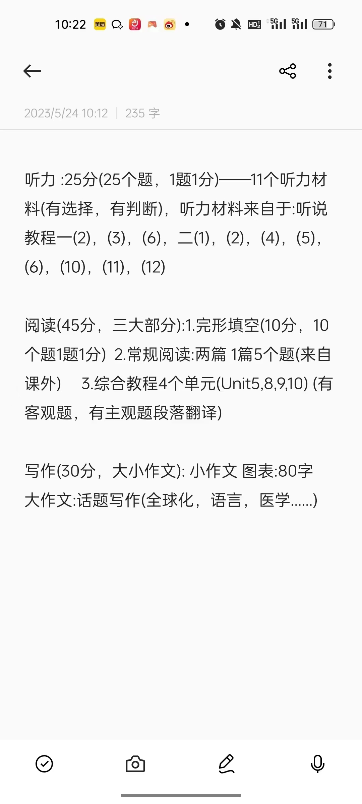

# 听力教程一：2，3，6

## Unit2

1. what is genetically modified food ?
	a. Fresh food  	b. Dangerous food 	***c. Altered food*** 

2. what genertically modified f ruit did the speaker mention ?

   ***a***. ***strawberryies*** 	b. apples 	c. bananas

3. what is a benefie of genetically modified food ?

   ***a***. ***it needs fewer pesticides*** 	b. it grows in less space. 	c. it dominates the environment

4. what is risk of genetically modified food ?

   a. it may stay fresh longer 	b. it may be more expensive 	***c***. ***it may be harmful to people***

5. what are three benefits of genetically modified food ?
   1. Genetically modified food needs fewer pesticides.
   2. Genetically modified food/plants grow better than normal
   3. In addition, they stay fresh longer after they are harvested

6. what are three risks of genetically modified food ?
   1. Genetically modified food/plants may dominate other plants in the environment.
   2. Also, they might hurt wild animals and insects
   3. They might even hurt the people who eat them


## Unit 3

1. what is public art ?

   a. art in museums 	b. art in people's houses  	***c. art in public places*** 

2. what sculpture is an example of realistic art ?

   a. Spoonbridge and Cherry(spoon and cherry) 	b. Non-violence(gun in knot) 	***c. Peace(voman on horse)***

3. what concept do two of the sculptures in the lecture symbolize ?

   a. public art 	b. surrealism 	***c. peace***

4. what is  the main purpose of public art ?

   a. to make people go to museums 	b. to make artists more popular 	***c. to make public places more beautiful***

5. what is pop art ? Given an example.

   pop art shows things people see in their everyday lives.

   spoonbridge and cherry, the sculpture of a large spoon with a cherry, is an example of pop art.

6. what is surrealistic art ? Given an example.

   surrealistic art shows things that are strange or impossible.

   Non-Vilolence, the sculpture of a gun tied in a knot, is an example of surrealistic art.


##  Unit 6

1. what do animals learn new skills ?

   a. Before the critical period 	***b. During the critical period*** 	c.After the critical period

2. what must young kittens learn to do ?

   ***a. See*** 	b. Eat 	c. Meow

3. what must young songbirds learn to do ?

   a. See 	b. Eat 	***c. Sing***

4. what changes after the critical period in humans ?

   a. The ability to hear sounds 	***b. The ability to pronounce sounds*** 	c. The size of  the brain

5. Define critical period. Given an example.

   The critical period is when an aimal or human can learn a new skill. 

   For example, in humans there is a critical period for language learning 

6. what is difficult for adult language learners ? why ?

   Adults find it difficult to pronounce sounds correctly. 

   Therefore, they may never learn to speak a new language with a native accent


# 听力教程二(1,2,4,5,6,10.11,12)

```cpp
5: 	family,				like it,		popularity,		meaning,	no longer,	 Biblicall;

13: common language,	only language 	every year 		not fluent 		daily communication;\
    
31:	are influenced, 	main activity, 	contributed further, 	understand 	identify with,			character loyalty;

40: a range of problems, not considered, not has same problems, 	brans work different, 	work right, 	flexible;

49: at once, 	total number, 	economic, 	per year from each country, 	give up,	where came from;

88: 1860->1953, 	cells tell DNA, 	the same, 	blue, 	develop, 	cause, 	doesn't tell us much 	,negative;

98: traveling more, 	where they live, 	must have immunity,	 too hard, 	immune responses, 	healthy lifestyle;

107 : response plan, 	make preparing , 	uncertainty, 	having a plan,	research provide recover, 	minimize damage;                                                                                         
```


# 作文模板 

```markdown
# 80words 图表类
1.
The chart/graph/diagram presents a range of data points in [specific period] and provides a comprehensive depiction of [topic]. 
	
	 It is evident that there is a discernible strong association. 
3. 
In conclusion, the chart/graph provides valuable information regarding topic .Additionally, there is a likeihood that the observed trend will continue in the future.


# 大作文，话题写作
1. 一个subject，its impact,these essay(life)
... has been a subject of widespread discussion and has garnered more and more attention in recent times. Its impact reaches far and wide, raising important questions and prompting diverse opinions.
This essay aims to explore the multifaceted aspects of ... and shed light on its implications in various aspects of life.

2. phenomenon, understanding, hence
... is  a complex phenomenon that has intrigued scholars,researchers, and society as  a whole.
Understanding the  complex nature of ... is crucial for addressing its challenges and making informed decisions. Hence, exploring its various dimensions becomes imperative.

3. 关键方面，研究表明一致， 重要性
Crucial aspects of [topic] are their influences on [specific aspects]. Numerous studies have consistently demonstrated [supporting evidence], underscoring the importance of tackling this issue and taking proactive steps to minimize its negative effects.

4. 探索揭示了复杂特性和对生活的影。通过解决关键方面，有一个更全面的理解 和更有效的解决方案。
	该不容缓，应对挑战，铺路
In conclusion, the exploration of [topic] reveals its multifaceted nature and its impact on various aspects of life. By addressing the key dimensions of [specific aspect] and [specific aspect], we can strive towards a more comprehensive understanding and effective solutions. It is imperative for policymakers, individuals, and society as a whole to collaborate and take actions to tackle the challenges posed by [topic] and pave the way for a brighter future.
```

